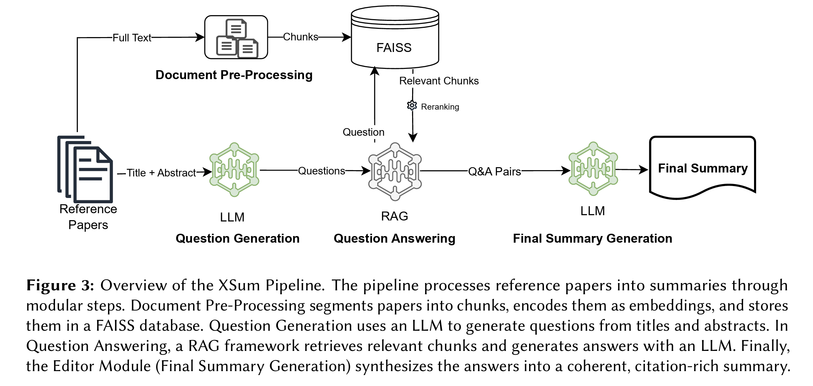
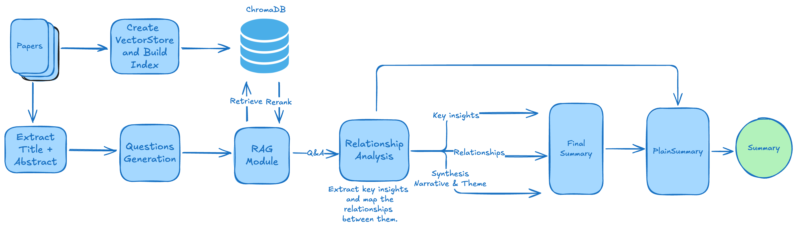

## Table of contents


## Introduction

To address the challenge of multi-document summarization in my own workflow, I explored and implemented *[X-Sum—Ask, Retrieve, Summarize: A Modular Pipeline for Scientific Literature Summarization](https://arxiv.org/html/2505.16349v1)*. While we often think of Retrieval Augmented Generation (RAG) as a standalone pattern, this paper demonstrates an integration of RAG into an agentic workflow. In this post, I'll explain my implementation of X-Sum, my assumptions, and demonstrate some fundamentals of building an agentic workflow.

Multi-document summarization (MDS) remains a challenge, even with advances in large language models. The concept is not new, and the task is relevant to any knowledge workflow. The goal is to automatically condense large volumes of related documents into a single, concise summary while preserving salient information, allowing information professionals to quickly digest the essentials. Because information comes from multiple sources with different structures, writing styles, and perspectives, fusing it into a coherent, logically flowing summary, while accounting for redundancy and contradictions, is a fundamentally harder compositional problem.



X-Sum is a sequential pipeline with four modules: ingestion, question generation, question answering, and summary generation. Figure 3 from the paper describes each module. The framework automatically generates questions about the main themes and contributions of a list of papers using an LLM. It then answers those questions using RAG, and finally uses the questions and answers to generate the summary.

RAG is a pattern that grounds LLM answers in recent information or private datasets, helping prevent hallucinations and, in practice, expanding access to an external knowledge base. Here, the RAG module serves as an insight-extraction tool.

This approach is clever and practical, and likely more cost-efficient than "stuff and summarize," which involves cramming full-text papers into the LLM context window and asking it to summarize. If you're already indexing your documents, adding a question-generation module to support summarization is also practical. As the paper notes, X-Sum can produce a factual summary that includes most of the core information across the papers.

However, for my use case, even though the process is complete, relevant, and accurate, it was less useful. I wanted a summary that compares insights and inner workings, so it is easier to quickly understand differences and relationships between findings and outcomes.

To test and understand this approach, I implemented it as-is, then improved it for my own needs.

---

## Implementation — Pipeline 1: The Paper's Approach

The pipeline is straightforward. Three agents, ChromaDB as the vector store, and ColBERT reranking.

```
PDFs → Chunk/Embed (ChromaDB + allenai-specter)
     → ExtractAbstract agent  (title + abstract per paper)
     → QuestionsAgent         (K questions per abstract)
     → Semantic search        (MMR, top 100 chunks per question)
     → ColBERT rerank         (keep top 3)
     → SummaryAgent           → single prose narrative
```

### Why this architecture works

**Generate questions first, retrieve second**. Questions are generated from each paper's title and abstract before any retrieval occurs. This forces the model to identify the important aspects and components of each paper without reading the full document — making it both token-efficient and analytically deliberate, rather than a passive scan.

Question-driven retrieval is also semantically richer. Instead of one vague query like "summarize these papers," each question targets something specific the document should answer. This matters especially across a diverse corpus where papers use different vocabularies to describe related ideas — a question bridges that gap better than a keyword ever could.

The compounding effect is significant: with K=5 questions per paper across 10 papers, you produce 50 targeted retrieval queries, each pulling the most relevant passage for a concrete information need.

**ColBERT reranking.** After semantic search returns 100 candidate chunks per question, ColBERT re-scores them as cross-encoder pairs (query, chunk) and keeps the top 3. This is significantly more accurate than embedding similarity alone, and cheaper than asking an LLM to score relevance — ColBERT runs locally.

**Domain-specific embeddings.** `allenai-specter` is trained on scientific paper citations — it understands that "methodology" and "approach" are semantically close in academic writing in a way a general-purpose embedding model may not.

### The input data

I tested with 10 RAG papers.

1. Self-RAG: Learning to Retrieve, Generate, and Critique Through Self-Reflection
2. PaperQA: Retrieval-Augmented Generative Agent for Scientific Research
3. RAPTOR: Recursive Abstractive Processing for Tree-Organized Retrieval
4. RQ-RAG: Learning to Refine Queries for Retrieval-Augmented Generation
5. From Local to Global: A GraphRAG Approach to Query-Focused Summarization
6. FlashRAG: A Modular Toolkit for Efficient Retrieval-Augmented Generation Research
7. HippoRAG: Neurobiologically Inspired Long-Term Memory for Large Language Models
8. MemoRAG: Boosting Long Context Processing with Global Memory-Enhanced Retrieval Augmentation
9. LightRAG: Simple and Fast Retrieval-Augmented Generation
10. Agentic Retrieval-Augmented Generation: A Survey on Agentic RAG

### The agents

Each agent is a prompt + structured output. The OpenAI Agents SDK makes this clean:

```python
class AbstractQuestions(BaseModel):
    question: List[str]

def create_agent_generate_questions(k: int):
    INSTRUCTIONS = (
        f"You are a helpful researcher assisting in understanding scientific papers. "
        f"Your task is to read a paper title and abstract and generate {k} broad, semantically rich questions "
        "that encapsulate the core themes and contributions of the paper. "
        "Each question must be clear, well-formulated, and address a distinct aspect: "
        "context, background, objective, methodology, or findings. "
        "Do not reference the passage itself or its authors."
    )
    return Agent(
        name="QuestionsAgent",
        model=GENERATION_MODEL,
        instructions=INSTRUCTIONS,
        output_type=AbstractQuestions
    )
```

`Runner.run(agent, input=...)` handles the LLM call and parses the response into the Pydantic model automatically. You get a typed object back — no JSON parsing, no prompt hacking to extract structured data.

The `SummaryAgent` receives all (question, chunks) pairs as a flat dump and generates the final narrative:

```python
def create_agent_final_summary():
    INSTRUCTIONS = (
        "You are a helpful researcher summarizing a corpus of scientific papers. "
        "Approach the task as if writing the final script of an interview with an expert. "
        "Generate a cohesive and comprehensive summary aggregating ALL question-answer pairs into a unified narrative "
        "that reflects the overarching themes and contributions of the papers. "
        "Include the most relevant and important points. "
        "Write extensive, coherent prose that seamlessly integrates the most important individual answers while maintaining logical flow. "
        "Be aware of plagiarism — use the text as inspiration, do not copy it. "
        "IMPORTANT: findings from ALL questions must be included using coherent transitions. "
        "Avoid markdown formatting, subsections, introductions, or conclusions. "
        "Do not introduce new information beyond what is in the inputs."
    )
    return Agent(name="SummaryAgent", model=GENERATION_MODEL,
                 instructions=INSTRUCTIONS, output_type=SummaryOutput)
```

### Generated Summary - Pipeline 1

_Large language models (LLMs) exhibit notable achievements in natural language processing but face limitations, particularly concerning factual accuracy and the management of irrelevant contexts, which often lead to hallucinations or incorrect outputs. Recent advancements in Retrieval-Augmented Generation (RAG) frameworks, such as Self-Reflective Retrieval-Augmented Generation (SELF-RAG), show promise in addressing these issues by enhancing LLMs' capabilities through adaptive retrieval mechanisms and self-reflective processes. SELF-RAG, in particular, trains models to dynamically retrieve relevant information and reflect on both its outputs and the context, significantly improving performance on various tasks including open-domain question-answering and fact verification_.

_The integration of reflection tokens within SELF-RAG allows for tailored responses and better control during inference. Meanwhile, newer frameworks like the PaperQA system apply RAG methodologies to scientific literature, demonstrating substantial gains in answering complex queries while ensuring accuracy and reliability in context processing. PaperQA can outperform existing models on benchmarks and effectively address real-time data retrieval challenges_.

_Furthermore, the RAPTOR model introduces a recursive structure for summarizing and retrieving information, allowing for improved processing of long documents and delivering more coherent responses. The dual-system architecture introduced in the MemoRAG framework bolsters long-context processing by seamlessly integrating global memory structures, enhancing retrieval's effectiveness in delivering higher-quality answers_.

_Agentic RAG systems, characterized by the involvement of autonomous AI agents, elevate RAG capabilities by dynamically managing the workflow through collaborative models, iterative reasoning, and flexible decision-making processes. This adaptability positions Agentic RAG at the forefront of AI technology, particularly in complex applications across diverse sectors like healthcare, finance, and education. However, these systems face scaling challenges and require specialized benchmarks to evaluate their unique capabilities effectively_.

_Overall, the research highlights the critical transition in RAG methodologies towards addressing the multifaceted challenges of LLMs, emphasizing the need for robust frameworks that integrate real-time data retrieval, enhance contextual understanding, and improve efficiency across varied applications_.

---

## Diagnosis — What's Missing

After running Pipeline 1 on eight RAG papers, the output was factually correct and covered the papers — but not in the way I needed.

**1. Paraphrasing, not synthesis.** The summary strings Q&A answers together with connectors ("Building on X...") but never identifies *why* papers relate. The SummaryAgent has no model of the intellectual landscape — it's doing surface-level aggregation, not synthesis.

**2. Siloed questions.** Questions are generated per-paper in isolation. A question about paper A retrieves chunks from paper A (and maybe B if they share vocabulary). Cross-paper insights — "paper C extends the approach in paper A by adding X" — are never surfaced because no question asks for them.

**3. No coverage structure.** The SummaryAgent receives a flat dump of 50 Q&A pairs. It can overweight the papers whose answers were most verbose and silently skip others. There's no structural signal about which Q&A pairs belong to which paper.

**4. Single audience, single output.** The expert narrative is not shareable with non-technical stakeholders. A second pass for plain language requires a separate manual effort.

I also realized that what I was looking for was more of a synthesis than a summary. I wanted to extract the main ideas, but also show how they relate to one another, and how they complement, expand on, or contradict each other. A summary restates the main points of a single text in a shortened form, focusing on accuracy. A synthesis combines key ideas from multiple sources to form a new, original argument or theme.

In addition, a summary or synthesis can be created from different perspectives or personas : novice or professional, plain language or technical, executive or scientific. A modular summarization pipeline should support generating summaries for each perspective, persona or style.

---

## My Implementation Changes — Pipeline 2

The changes below address the diagnosed problem overall, though not all are covered. The retrieval infrastructure (ChromaDB, ColBERT, chunk size) is identical; all changes are in the agents and data flow.



### Change 1: QuestionsAgent — focus on inner workings

The original prompt asks for questions covering "context, background, objective, methodology, or findings" — a broad, generic list. I replaced it with a focused directive:

**Before:**
```
"Each question must be clear, well-formulated, and address a distinct aspect:
context, background, objective, methodology, or findings."
```

**After:**
```
"Prioritize questions that probe the inner workings of the described method, system, or application:
how it is designed, how it operates step-by-step, what mechanisms or algorithms drive it,
how its components interact, and why specific design choices were made."
```

This produces questions like "How does the retrieval component decide which chunks to return?" instead of "What are the main contributions of this paper?" — far more useful for downstream comparison across papers.


### Change 2: Carry paper provenance through the pipeline

A small data structure change with big downstream consequences. In Pipeline 1, `all_questions` is a flat `List[str]` — paper identity is lost the moment questions are generated.

```python
# Pipeline 1
results_questions: List[str] = []
for abstract_result in results_abstracts:
    questions = await generate_questions(abstract=content, k=K_QUESTIONS)
    results_questions.extend(questions.question)  # paper identity lost here
```

In Pipeline 2, questions carry their source paper:

```python
# Pipeline 2
all_questions: List[tuple] = []  # (paper_title, question)
for abstract_result in results_abstracts:
    questions = await generate_questions(abstract=content, k=K_QUESTIONS)
    for q in questions.question:
        all_questions.append((abstract_result.title, q))
```

This flows into `agentic_qa_pairs`, which gains a `paper_title` key. The FinalSummaryAgent can now group evidence by paper and verify full coverage — every paper title in the input must appear in the output.

### Change 3: Add RelationshipAgent — the key architectural insight

This is the most important change. A new agent sits between retrieval and summarization, doing one job: understand how papers relate before any prose is written.

```python
class PaperInsight(BaseModel):
    insight: str = Field(description="A concise statement of a key finding or contribution")
    source_questions: List[str] = Field(description="The question(s) this insight came from")

class PaperRelationship(BaseModel):
    insight_a: str
    insight_b: str
    relationship_type: str  # extension | contradiction | complementary | improvement | parallel
    explanation: str        # one or two sentences

class RelationshipAnalysis(BaseModel):
    key_insights: List[PaperInsight]       # one per Q&A pair, no omissions
    relationships: List[PaperRelationship] # how insights connect
    overall_theme: str                     # overarching intellectual theme
    synthesis_narrative: str               # 3-5 sentence connective argument, ALL papers
```

The agent prompt decomposes the task into three explicit steps:

```python
INSTRUCTIONS = (
    "Your task has three steps:\n"
    "Step 1 — Extract key insights: for each Q&A pair, identify the most important finding "
    "or contribution. Extract an insight for EVERY Q&A pair — do not skip any.\n"
    "Step 2 — Analyze relationships: classify as extension, contradiction, complementary, "
    "improvement, or parallel.\n"
    "Step 3 — Write a synthesis narrative: in 3-5 sentences, describe how ALL the papers "
    "collectively advance the field. Every paper's key contribution must be mentioned. "
    "Write as a connective argument: 'while X addresses..., Y extends this by..., "
    "and Z takes a different angle by...'. "
    "This narrative is the structural spine the final summary will be built around."
)
```

**Why this matters:** The SummaryAgent no longer has to infer relationships from raw Q&A evidence. The intellectual work of mapping connections is done separately, by a dedicated agent, before any prose is written. The `synthesis_narrative` becomes the argument the final summary expands — not something the final agent has to construct from scratch under pressure.

**Example of relationships extracted**

* **EXTENSION**: _**GraphRAG's** approach integrates knowledge graphs with query-focused summarization, enhancing the comprehensiveness and relevance of answers to global questions.... ↔ **LightRAG** incorporates graph structures into retrieval tasks, significantly improving the contextual efficiency of information processing and retrieval outcomes...._
_Both insights discuss the improved outcomes resulting from the integration of graph structures within their respective frameworks_.

* **PARALLEL**: _Implementing a single arbitrary language model in **SELF-RAG** allows for increased adaptability across various tasks and domains, enhancing its general utility in dynamic applications.... ↔ The **PaperQA** system comprises three fundamental components: finding relevant papers, gathering text, and generating answers, improving scientific question answering through structured information retrieval...._
_While both systems aim at adaptability and improving retrieval, they focus on distinct applications: SELF-RAG in general use and PaperQA in scientific contexts_.


### Change 4: FinalSummaryAgent — synthesis-first prompt structure

The prompt given to the FinalSummaryAgent was restructured into three explicit parts:

```python
# Part 1 — Synthesis Spine
user_input = "### Part 1 — Synthesis Spine\n\n"
user_input += f"Overall Theme: {analysis.overall_theme}\n\n"
user_input += f"Synthesis Narrative: {analysis.synthesis_narrative}\n\n"
user_input += "All Key Insights (cover every one):\n"
for ins in analysis.key_insights:
    user_input += f"- {ins.insight}\n"

# Part 2 — Evidence grouped by paper
user_input += "\n### Part 2 — Evidence by Paper\n"
for paper_title, pairs in groupby(sorted_pairs, key=lambda x: x['paper_title']):
    user_input += f"\n**{paper_title}**\n"
    for qa in pairs:
        user_input += f"Q: {qa['question']}\nA: {qa['answer'][:500]}\n\n"

# Part 3 — Relationship map
user_input += "\n### Part 3 — Relationship Map\n"
for rel in analysis.relationships:
    user_input += f"{rel.insight_a[:70]}... [{rel.relationship_type}] → {rel.insight_b[:70]}...: {rel.explanation}\n"
```

The agent is instructed to open by expanding the `synthesis_narrative` (not replace it), ground each insight with evidence from the corresponding paper in Part 2, and use the relationship map only for connective transitions. **Prompt architecture matters as much as agent architecture.**

**Generated Summary — Pipeline 2 (Static Retrieval + Relational Synthesis)**

_The burgeoning field of retrieval-augmented generation (RAG) frameworks showcases transformative methodologies that are addressing the traditional limitations of language models (LMs), particularly in terms of responsiveness and contextual adaptability. At the forefront of this evolution is the SELF-RAG framework, which innovatively combines retrieval with self-reflection mechanisms, significantly improving factual accuracy and overall response quality. By employing adaptive on-demand passage retrieval alongside reflection tokens, SELF-RAG allows models to critique their outputs while integrating retrieved passages, thus enabling an introspective evaluation of generated responses. Empirical tests reveal that this framework yields substantial improvements, validated by enhanced SP scores on various datasets, indicating its prowess in delivering accurate answers across diverse tasks and domains_.

_Complementing this work, the PaperQA system stands out in the scientific literature retrieval space. It structures information retrieval through an agent-based mechanism that comprises three essential components: identifying relevant papers, gathering text, and synthesizing answers. PaperQA's innovative mechanisms, such as map-reduce steps and LLM-generated relevance scoring, have proven effective in mitigating issues of hallucination and uninterpretability that often plague traditional LMs. Both SELF-RAG and PaperQA are united by their commitment to enhancing adaptability and improving retrieval efficiencies; however, they target different applications that highlight their unique methodologies_.

_Building on the structure established by PaperQA, the RAPTOR model introduces recursive embedding and clustering, which significantly enhance the processing of complex data. This model capitalizes on the idea of constructing summarization trees that facilitate the integration of information across varying abstraction levels within lengthy documents. The performance improvements yielded by RAPTOR on multi-step reasoning tasks illustrate the promising efficacy of recursive summarization techniques, offering state-of-the-art results in question-answering applications_.

_In contrast, RQ-RAG refines retrieval mechanisms through sophisticated query optimizations, including context-prefilling and bilevel hierarchical attention. These enhancements empower RQ-RAG to tackle ambiguous and complex queries effectively, reinforcing its capability to integrate real-time external data. The results demonstrate significant advancements in single-hop and multi-hop question-answering tasks compared to existing methodologies_.

_GraphRAG and LightRAG share a focus on integrating graph structures into their respective frameworks, with GraphRAG utilizing knowledge graphs to enhance the effectiveness of query-focused summarization. By employing community summaries to address complex queries, GraphRAG promotes enhanced response diversity and relevancy across large datasets. LightRAG extends this principle by incorporating a dual-level retrieval system that optimally balances detail and breadth in information processing, thus improving contextual efficiency and adaptability in dynamic environments_.

_FlashRAG introduces a modular toolkit that democratizes research in RAG methodologies by providing customizable components and organized datasets, facilitating comparative studies. This emphasis on modular design aligns with the principles of Agentic RAG, which envisions autonomous AI agents capable of dynamic decision-making and collaborative workflows. Challenges regarding scalability within Agentic RAG are systematically addressed, emphasizing ethical decision-making and performance optimization for effective multi-domain applications_.

_Together, these advancements in RAG frameworks—each with distinctive methodologies—act as a cohesive response to the current challenges faced in the landscape of language models. They not only represent significant strides in operational efficiency but also underscore the ongoing effort to enhance contextual understanding, ultimately paving the way for more effective, flexible, and adaptive AI systems capable of meeting the multifaceted demands of modern applications_.


### Change 5: PlainLanguageAgent — audience targeting

A final translation agent converts the expert summary into plain language. It receives the expert summary as primary input, with the `synthesis_narrative` added as a structural scaffold:

```python
user_input = f"### Expert Summary to Translate\n{final_summary_text}\n\n"
user_input += f"### Structural Spine (use as your narrative arc)\n{analysis.synthesis_narrative}\n\n"
user_input += "### Supporting Q&A Pairs\n\n"
# ...
```

The agent is instructed to preserve the argument arc, keep each paper's contribution distinguishable, use analogies for abstract concepts, and use active voice throughout. Same pipeline, second audience, one extra agent.


**Plain Language Summary (General Audience)**

_In the evolving world of artificial intelligence, particularly in how machines handle language and information, a new approach called retrieval-augmented generation, or RAG, is making waves. One of the standout frameworks in this area is called SELF-RAG. This framework cleverly combines two strategies: it retrieves relevant information on-demand and encourages the AI to reflect on what it has generated. This means the AI can check its own answers against retrieved information, leading to better accuracy and more meaningful responses. Research has shown impressive results for SELF-RAG, marking significant improvements in its ability to provide correct answers across various tasks_.

_Another important system is called PaperQA. This system is designed specifically for digging through scientific literature. It works by first finding relevant research papers, collecting text from them, and then generating answers based on that data. PaperQA’s unique design includes innovative steps that help reduce mistakes—often called hallucinations—in AI answers. This means that, unlike many traditional AI systems that can give incorrect references or information, PaperQA is much more dependable and accurate when answering scientific questions. The introduction of a tough new benchmark called LitQA further demonstrates PaperQA’s strengths, pushing it closer to how humans typically research and find answers_.

_Building on these ideas, another model called RAPTOR takes things even further. RAPTOR features a recursive method of summarization, which means it organizes and simplifies complex data into easily digestible pieces. This method allows it to effectively understand and process lengthy documents, leading to marked improvements in answering complicated questions that require a series of steps to solve_.

_Meanwhile, RQ-RAG refines the way it retrieves information, enhancing its capabilities to answer tricky questions that might be confusing or ambiguous. Its improvements allow for real-time access to data, which adds to its accuracy, especially in answering questions that require multiple layers of understanding_.

_GraphRAG and LightRAG are two systems that take advantage of graph structures to enhance their retrieval processes. GraphRAG uses knowledge graphs to improve the quality of answers, ensuring they are detailed and relevant. LightRAG’s strength lies in its dual-level retrieval, which balances the details of specific topics with broader ideas, resulting in better responses overall_.

_Lastly, FlashRAG aims to simplify RAG research by providing a modular toolkit that researchers can easily use and customize. This includes pre-made components and datasets that help researchers build and test new systems without starting from scratch. By offering a flexible design and comprehensive resources, FlashRAG encourages innovation and progress in the field of retrieval-augmented generation_.

_All these advancements reflect a collective effort to push AI further by making it more efficient, accurate, and relevant to the dynamic needs of users, marking a promising future for how machines process and interact with information_.


---

## Comparison

| Dimension | Pipeline 1 | Pipeline 2 |
|-----------|-----------|-----------|
| Agents | 3 (Extract, Questions, Summary) | 5 (+Relationship, PlainLanguage) |
| Retrieval | ColBERT rerank, top 3 of 100 | Same |
| Relationship analysis | None | RelationshipAgent (3-step) |
| Summary structure | Flat Q&A dump → prose | Synthesis spine → evidence by paper → relationship map |
| Per-paper coverage | Implicit | Explicit (grouped by paper_title) |
| Question focus | Broad themes and contributions | Inner workings: mechanisms, design choices, interactions |
| Output variants | 1 (expert prose) | 2 (expert + plain language) |
| LLM calls | ~K×N + 1 | ~K×N + 2 extra (Relationship + PlainLanguage) |
| When to use | Quick factual digest | Deep comparative synthesis |

**Pipeline 1 is better for:** speed, simplicity, reproducibility, token efficiency.

**Pipeline 2 is better for:** comparative synthesis across papers, understanding *how* methods differ and relate, producing outputs for multiple audiences.

The core insight: **explicit relationship modeling before summarization produces better summaries than asking a single agent to infer relationships from raw evidence.** The extra two LLM calls are worth it.

---

## What I'd Try Next

These are simple experiments — each adds one section to a notebook.

**1. Cross-paper question generation.** After generating per-paper questions, add one more QuestionsAgent call that receives all abstracts together and generates 3-5 comparative questions — "What distinguishes approach X from approach Y?", "Which paper makes the strongest empirical claim?" These questions drive retrieval that siloed per-paper questions will never surface.

**2. LLM-based relevance scoring.** Replace ColBERT with a lightweight relevance scorer: one LLM call rates each chunk 1-10 for relevance to the question. More semantically precise than ColBERT for domain-specific content; more expensive but instructive as a comparison. Good teaching experiment for the trade-off between model-based and embedding-based reranking.

**3. Relationship type distribution as a diagnostic.** After running RelationshipAgent, count the relationship types. A corpus where everything is "complementary" suggests weak differentiation between papers — or weak questions. A corpus with several contradictions is scientifically interesting. This diagnostic is free: you already have the data.

**4. Iterative question refinement.** After seeing the RelationshipAnalysis, a QuestionRefinementAgent generates follow-up questions targeting papers with weak insight representation. One more agent, one more pass through retrieval, notably better coverage for underrepresented papers.

---

## Conclusion

X-Sum is a solid, practical baseline for multi-document summarization. The modular design — generate questions, retrieve, summarize — is the right abstraction. It's reproducible, cost-efficient, and factually grounded.

The improvements in Pipeline 2 are not radical departures: same retrieval infrastructure, same embedding model, same vector store. The difference is structural. Carrying paper provenance through the pipeline, separating relationship analysis from prose generation, and giving the final agent a pre-built synthesis spine instead of a flat Q&A dump — these are prompt architecture and data flow decisions, not tooling changes.

The real lesson: **building agentic pipelines is mostly about how you decompose tasks and structure information flow between agents.** A well-structured prompt given the right inputs consistently outperforms a generic prompt given everything at once.

GitHub Project: https://github.com/mayerantoine/explore-xsum
 
