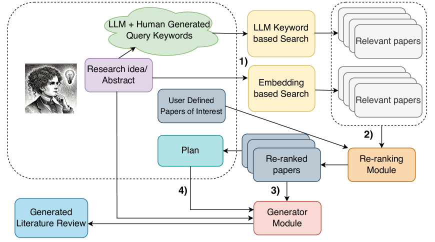
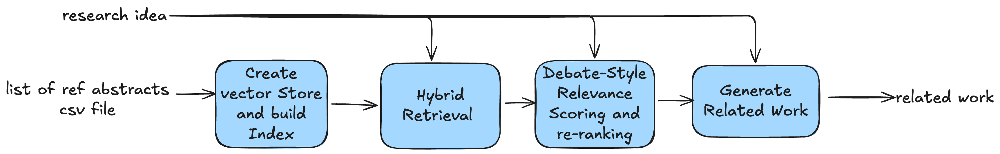
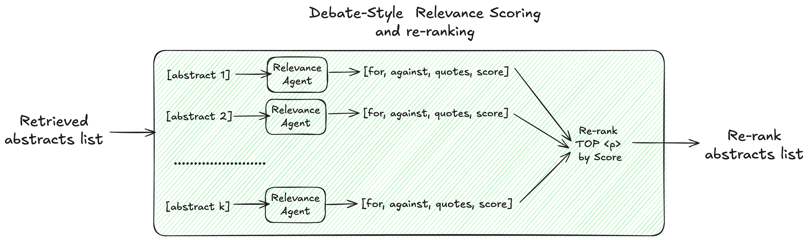

## Table of contents


Have you ever collected 100 paper abstracts on a topic and needed to quickly synthesize the previous work into a cohesive 2–3 paragraph summary? This might be for a paper, conference presentation, or your own learning. You could use AI tools like ChatGPT, Perplexity, [Scite.ai](http://Scite.ai), or ThesisAI—but you'd need to pay a subscription, upload all your data, and work around context and data limitations every time you generate your summary.

What if you could build your own tool using state-of-the-art techniques, your own API key, and pay only for what you use? You can use it whenever you need it and improve it over time.

In this post, I'll provide a step-by-step guide on building an AI workflow to generate your literature review based on the paper "[LitLLMs, LLMs for Literature Review: Are we there yet?](https://arxiv.org/abs/2412.15249) I'll explain how to reproduce LitLLM in a notebook, share my proof-of-concept CLI tool, and  web application code for local or cloud deployment.**

## **LitLLM**

In their paper "LitLLMs, LLMs for Literature Review: Are we there yet?" (*Trans. Mach. Learn. Res.* 2025), Agarwal, Shubham et al. demonstrate how to use search, retrieval-augmented generation, and LLM prompting to generate the related work section of papers based on an abstract input. They used a two-step approach: first, given your abstract idea or draft, they generate keywords to search journal databases using several journals API. Second, they use RAG to retrieve the most similar abstracts, then rerank them using an LLM Debate reranking technique. Finally, they use the top relevant abstracts to generate the related work  guided by prompt plan. The diagram below from the paper shows the different steps.

Using their Rolling-Eval and Multi-Science X datasets, the authors evaluated and compared their approach with different summarization techniques and  LLM models. They concluded that their strategy has "significant potential for writing literature reviews, especially when the task is decomposed into these smaller and simpler sub-tasks that are within reach of LLMs" and helps reduce hallucinations. Their demo is available at: [https://litllm.onrender.com/](https://litllm.onrender.com/).



*From the paper : Figure 1:A schematic diagram of our framework, where: 1) Relevant prior work is retrieved using keyword and embedding-based search. 2) LLMs re-rank results to find the most relevant prior work. 3) Based on these papers and the user abstract or idea summary, an LLM generates a literature review, 4) optionally controlled by a sentence plan.*

## Our implementation

For my use case, I usually do the manual keyword search on multiple databases using my research idea, learning topics, or research questions—either myself or with the help of a librarian. The result is a list of titles and abstracts as a CSV file. This implementation simplifies the process by skipping the LitLLM search portion, which makes it more practical based on my experience. In other words: **given a list of hundreds of reference abstracts and your research idea, how do you generate a concise summary?**

The workflow includes 4 major steps:

- **Vector Database**: Create vector store  for your reference abstracts.
- **Hybrid Retrieval**: Combining semantic search (vector embeddings) and keyword search (BM25)
- **Debate-Style  Relevance Scoring**: Agent generates arguments FOR and AGAINST
including each paper, then assigns probability score
- **Async Parallel Processing**: Scores multiple papers concurrently
- **Automated Synthesis**: Generating coherent literature reviews with proper citations



### **Vector Database**

This summarization uses RAG systems, so the first step is to create a vector index of the reference abstracts. The goal is not to use the RAG for question answering or chatbot, but to leverage the retrieval components of RAG to filter out abstracts from your keyword search that are not semantically or lexically relevant to your research idea.

I use ChromaDB vector store and the RecursiveCharacterTextSplitter for chunking to split the abstracts, then embed them using sentence transformers all-MiniLM-L6-v2. Chunking  strategy and Embeddings are parameters you can change(such as SPECTER2 as in the paper)  to improve your own tool, you can even use a difference vector store such as PineCone, FAISS or Qdrant.

### **Hybrid Retrieval**

Given the research question, I used a hybrid retrieval strategy to select top abstracts from my reference abstracts. The hybrid search combines BM25 keyword search for exact string matching and semantic search with **Maximum Marginal Relevance (MMR) to retrieve a diverse set of abstracts, getting the best of both worlds.**

### **Debate-Style  Relevance Scoring**



The key innovation of this summarization approach is LLM relevance scoring that evaluates each paper using a debate-style method. Instead of simply prompting the LLM to assign a relevance score, they used "debate prompting"—**a method that uses the structure of a debate to generate more balanced, critical, and creative outputs from AI models or to improve human critical thinking** . It involves instructing an LLM to argue both sides of an issue, act as a debate opponent, or simulate different expert perspectives. This elicits a more thorough analysis than a simple request for an opinion. You can also ask multiple personas for their opinions on a subject. Unlike chain-of-thought prompting, debate prompting allows LLMs to re-evaluate their outputs. By allowing the LLM to debate itself and analyze multiple viewpoints, a more nuanced understanding emerges—which in this case leads to a better relevance score.**(Vivaan Sandwar et al. 2025, Rahaman et al. 2024)**

For my implementation of Debate relevance scoring, I used an OpenAI  agent that executes the following steps:

1. Generate arguments **for** including the abstract
2. Generate arguments **against** including the abstract
3. Extract supporting quotes from the abstract
4. Assign a relevance probability score (1–100)

This structured reasoning helps ensure high-quality relevance judgments. 

```jsx
# Define the structured output model for relevance scoring
class AbstractRelevance(BaseModel):
    """Structured relevance assessment for a candidate paper."""
    id: int
    arguments_for: str
    arguments_for_quotes: list[str]
    arguments_against: str
    arguments_against_quotes: list[str]
    probability_score: Annotated[
        float, 
        Field(ge=1.0, le=100.0, description="A relevance score between 1 and 100.")
    ]

def create_relevance_agent():
    """Create an agent that scores paper relevance using debate-style reasoning."""
    
    INSTRUCTIONS_DEBATE_RANKING = """ 
    You are a helpful research assistant who is helping with literature review of a research idea. 
    You will be given a query or research idea and a candidate reference abstract.
    Your task is to score reference abstract based on their relevance to the query. Please make sure you read and understand these instructions carefully. 
    Please keep this document open while reviewing, and refer to it as needed.

    ## Instruction: 
    Use the following steps to rank the reference papers:

    1. Generate arguments for including this reference abstract in the literature review.

    2. Generate arguments against including this reference abstract in the literature review.

    3. Extract relevant sentences from the candidate paper abstract to support each argument.

    4. Then, provide a score between 1 and 100 (up to two decimal places) that is proportional to the probability 
    of a paper with the given query including the candidate reference paper in its literature review. 

    Important:
    - Put the extracted sentences in quotes
    - You can use the information in other candidate papers when generating the arguments for a candidate paper
    - Generate arguments and probability for each paper separately
    - Do not generate anything else apart from the probability and the arguments
    - Follow this process even if a candidate paper happens to be identical or near-perfect match to the query abstract

    Your Response: """

    relevance_agent = Agent(
        name="RelevanceAgent",
        instructions=INSTRUCTIONS_DEBATE_RANKING,
        model=RELEVANCE_MODEL,
        output_type=AbstractRelevance
    )
    
    return relevance_agent

```

Then, score all retrieved papers in parallel using async execution for efficiency. Each paper is evaluated independently by the relevance agent. Then I select the TOP_K highest probability score most relevant abstracts.

```jsx
async def gather_abstract_relevance(retrieved_abstracts: pd.DataFrame, num_to_score: int = None) -> List[AbstractRelevance]:
    """Score multiple abstracts in parallel.
    
    Args:
        retrieved_abstracts: DataFrame of retrieved papers
        num_to_score: Number of abstracts to score (None = all)
    
    Returns:
        List of AbstractRelevance objects
    """
    # Select subset if specified
    if num_to_score is not None:
        abstracts_to_score = retrieved_abstracts.head(num_to_score)
        print(f"Scoring {num_to_score} abstracts (configured limit)")
    else:
        abstracts_to_score = retrieved_abstracts
        print(f"Scoring all {len(abstracts_to_score)} retrieved abstracts")
    
    # Create async tasks for parallel execution
    tasks = [
        asyncio.create_task(
            relevance_summary(
                id=item['id'],
                query=query,
                reference_paper=item['title_abstract']
            )
        )
        for index, item in abstracts_to_score[['id', 'title_abstract']].iterrows()
    ]
    
    print(f"Executing {len(tasks)} relevance scoring tasks in parallel...")
    results = await asyncio.gather(*tasks)
    
    return results
```

### **Automated Synthesis**

In this step, I used a simple OpenAI prompt that takes the number of sentences, number of words, research idea, and all relevant abstracts as inputs and generates a cohesive summary with clear citations.

```jsx
# Define instructions for related work generation
num_sentences = 10
num_words = 450

INSTRUCTIONS_RELATED_WORK = f""" 
You are an expert research assistant who is helping with literature review for a research idea or abstract. 
You will be provided with an abstract or research idea and a list of reference abstracts. 
Your task is to write the related work section of the document using only the provided reference abstracts. 
Please write the related work section creating a cohesive storyline by doing a critical analysis of prior work 
in the reference abstracts comparing the strengths and weaknesses while also motivating the proposed approach. 
You should cite the reference abstracts as [id] whenever you are referring it in the related work. 
Do not write it as Reference #. Do not cite abstract or research Idea. 
Do not include any extra notes or newline characters at the end. 
Do not copy the abstracts of reference papers directly but compare and contrast to the main work concisely. 
Do not provide the output in bullet points or markdown. 
Do not provide references at the end. 
Please generate {num_sentences} sentences in {num_words} words
Please cite all the provided reference papers if needed.
"""

# Build input for related work generation
input_related_work = f"Given the Research Idea or abstract: {query}"
input_related_work += "\n\n## Given references abstracts list below:"

for index, item in top_k_abstracts[['id', 'title_abstract']].iterrows():
    input_related_work += f"\n\n[{item['id']}]: {item['title_abstract']}"

input_related_work += "\n\nWrite the related work section summarizing in a cohesive story prior works relevant to the research idea."
input_related_work += "\n\n## Related Work:"

print(f"✓ Built generation input ({len(input_related_work)} characters)")

# Generate related work section
response = openai_client.responses.create(
    model="gpt-4o-mini",
    instructions=INSTRUCTIONS_RELATED_WORK,
    input=input_related_work
)

generated_related_work = response.output_text
```

## Building a Tool

Once you have this implementation, wrapping it into a command-line tool is straightforward. I used Typer to reorganize the notebook code into a simple app. The app works as follows:

- Takes a CSV file of abstracts as input
- Prompts you for your research question
- Executes the workflow described above
- Outputs the related work summary

You can adjust key parameters such as the number of chunks to retrieve, maximum papers to score, and top_k papers for generation. You can also modify the OpenAI model, output length (sentences and words), and chunking size. Test the CLI by cloning the repo and running `uv run main.py run`.

For a web-based solution, I built a Next.js frontend connected to a FastAPI backend. The backend wraps and exposes the indexing and generation endpoints using the core module from the CLI. The complete code is available at: [https://github.com/mayerantoine/lit-review](https://github.com/mayerantoine/lit-review).

## Conclusion

This tool helps me summarize related work on new ideas I'm learning after collecting abstracts. Using my OpenAI account—with no additional subscription cost—I can automate the summarization of hundreds of abstracts, review and edit them, re-run the process, and slowly build a second brain.

However, the output and writing flow aren't perfect yet. The current prompts don't organize ideas by concepts, present papers chronologically, or start with foundational concepts and a broad overview before diving into specific work. They also don't always discuss gaps or contradictions in depth. Additionally, this approach only uses abstracts, not full-text papers. There are still opportunities to improve quality by providing more guidance on how to structure ideas in the generated text.

### **Project Link**

- The full code is available at : https://github.com/mayerantoine/agentic-lit-llm