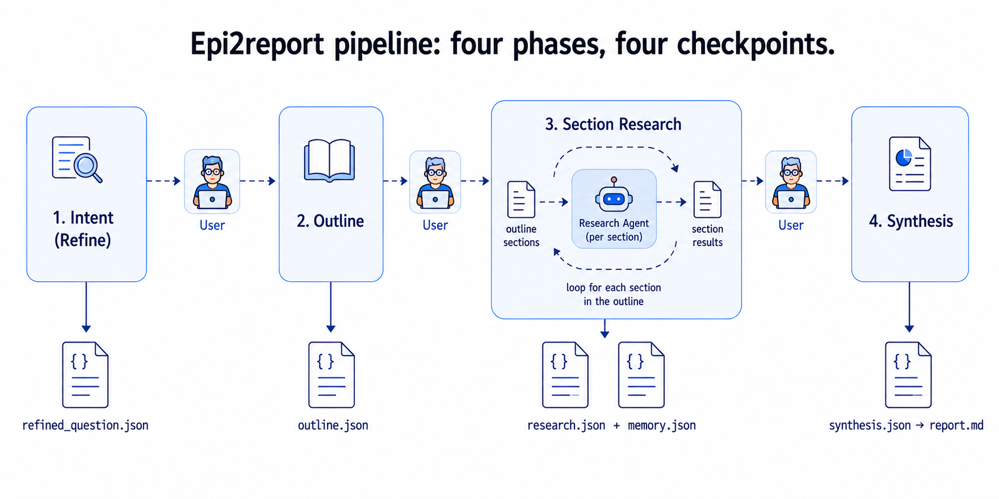
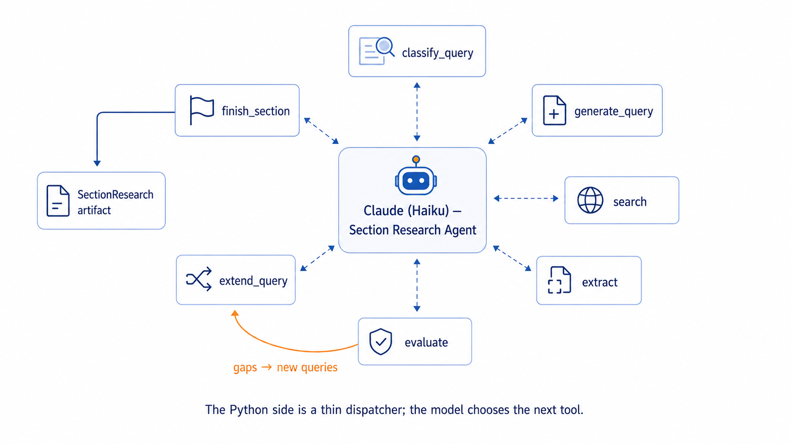
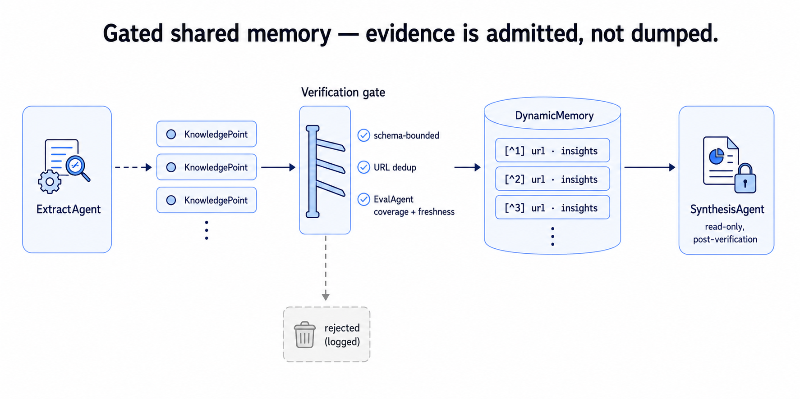

## Table of contents

## Introduction

**Building a Domain-Specific Deep Research Agent for Public Health.** First in a series. In this post I describe why I built a multi-agent deep research system for public health evidence synthesis, how the current pipeline is wired, and — honestly — everything that is still missing before I would trust it.

If you build agentic systems for high-stakes domains, you will leave with a pattern you can steal: a four-phase pipeline (Refine → Outline → Research → Synthesize), a gated shared memory that verifies before it admits, and globally consistent, source-level citations — the pieces you actually need to hand a generated report to a decision-maker.

## What you will learn

1. Why generic deep research agents fall short for domain-specific work like public health evidence synthesis.
2. How to decompose a research workflow into four phases — intent, outline, section research, synthesis — with human checkpoints at each step.
3. How to build an agentic research loop with a fixed tool belt (classify, generate, search, extract, evaluate, extend, finish) using Anthropic's tool-use API.
4. How to design a gated shared memory that admits evidence only after verification.
5. How to enforce source-level, globally consistent citations across a long report.
6. What is still missing (evals, tracing, benchmarks) before such a system can be trusted for high-stakes work.

## Why build a domain-specific deep research agent?
There is no shortage of "deep research" agents right now. OpenAI, Gemini, Perplexity, Grok, and a growing list of open-source frameworks (MiroFlow, OpenManus, WebThinker, Tongyi-DeepResearch) will happily accept a question and hand you back a long, well-formatted report with citations at the end. If you have used them, you already know the pattern — and you probably also know the feeling that comes right after: the report reads beautifully, but you have no idea whether you can trust it, use it for official work, send it to your boss.

For now, a deep research agent is useful and good at gathering information and synthesizing a comprehensive, detailed report about your question. You can read it, take notes, mark and annotate relevant references, grab a good synthesized snippet — then forget about it or throw it away. It's often not integrated into your reporting workflow; it's just an artifact in your chatbot, not a reproducible report you co-created and whose components and flow you understand.

For example, in public health, when someone asks a question like "What is the effectiveness of MMR in preventing measles among unvaccinated children under five in the United States between 2020 and 2024?", the answer needs to come from a specific, defensible slice of the literature — MMWR, EID, PCD, PubMed, WHO — with each claim traceable back to a source you can actually open. You need to know where each data point comes from, how it was calculated, and whether the methods used in each source are sound. This brings me to the idea that the one-shot approach of deep research driving the current hype might not be what knowledge workers are looking for, especially in a domain like public health. We need to co-create the report step by step, not 'vibe-generate' it.

Three goals guided the design from the start:

* Trust. Every sentence in the final report should trace back to a specific source URL. No hidden reasoning, no synthesized-but-uncited claims.
* Reproducibility. The pipeline should persist every intermediate artifact — the refined question, the outline, the search queries, the extracted knowledge points, the evaluation verdicts — so a colleague can open the run folder and replay exactly what the agent decided and why.
* Human control. The system should stop and ask before it goes too far in the wrong direction. It is cheap to fix a bad refined question. It is expensive to discover, five minutes into an evidence sweep, that the agent has been researching the wrong population all along.

The architecture that fits those goals clicked into place when I was reading *Mind2Report: A Cognitive Deep Research Agent for Expert-Level Commercial Report Synthesis* (Cheng et al., 2026, arXiv:2601.04879). Mind2Report is aimed at commercial analysis — think "NVIDIA H100 vs. AMD MI300X: which for LLM training in 2025?" — but the cognitive workflow it describes is domain-agnostic: probe fine-grained intent before searching, formulate a chapter-tree outline as a research contract, gather evidence into a memory that is verified before it becomes visible to downstream agents, and synthesize section by section to preserve coherence. That decomposition — intent → outline → memory-augmented search → coherence-preserved synthesis — is exactly what a public health report needs. The domain constraints (allow-listed sources, structured question framing, freshness thresholds calibrated to surveillance cycles) then bolt onto the same skeleton.

The framing I keep coming back to:

> The goal is not to generate a long research report. The goal is to build a research workflow where intent, search, evidence admission, and synthesis are explicit enough for the user to inspect, challenge, and reproduce each step of the process.

What makes this architecture different from the one-shot pattern most deep research agents follow: it is built around explicit evaluation loops and a dedicated, gated memory layer, rather than a single pass from retrieval through writing. It separates intent refinement and outline planning into interactive, human-validated stages instead of collapsing them into the same synthesis call. And it writes section by section from verified memory — no subagents, no parallel section workflows, at least not yet.

For now, the "public health" in the name is carried by three concrete choices: (1) an allow-listed source registry (MMWR, EID, PCD, PubMed, WHO), (2) source-type inference that tags each URL with its public-health category, and (3) a structured question frame in the Intent Agent tuned to public-health research shapes. That is a starting point, not a domain model — future work will layer a dedicated public-health knowledge layer across all agents (guideline hierarchies, surveillance cadence, population and comparator conventions) rather than expressing domain expertise only through allow-lists and prompt scaffolding.

In this post, I describe 'Phase 0' of my design for a deep research agent architecture, 'Epi2report', inspired by Mind2Report. The code is open source at [github.com/mayerantoine/epi2report](https://github.com/mayerantoine/epi2report).

## What works, what doesn't

What exists today:

- A four-phase pipeline — Refine → Outline → Research → Synthesize — runs end-to-end from a single command, with human checkpoints at each phase.
- Every phase writes a structured artifact to disk (`refined_question.json`, `outline.json`, `research.json`, `memory.json`, `synthesis.json`, `report.md`) so runs can be resumed, inspected, and diffed.
- A `DynamicMemory` object accumulates evidence across sections, deduplicates by URL, and assigns a stable citation ID to each source so `[^N]` markers stay consistent across the whole report.
- An agentic research loop (`ResearchSectionAgent`) drives one section at a time through a fixed tool belt, with hard budget caps and mandatory quality checks before knowledge is written to memory.
- Search is restricted to a configured allow-list — currently `pubmed.ncbi.nlm.nih.gov`, `cdc.gov/mmwr`, `wwwnc.cdc.gov/eid`, `cdc.gov/pcd`, `who.int`, and `apps.who.int`.
- A soft reference-matching pass (`verify.py`) checks that every `[^N]` in the report resolves to a memory entry and warns about strong factual claims (numbers, years, named studies, ACIP/CDC/WHO) that appear without a citation.

What does not exist yet:

- No formal eval suite or observability dashboard.
- No benchmarks or baselines.
- No structured regression tests around the agent workflow itself.
- Reproducibility is partial, achievable from saved artifacts. To move from "partial" to "strong" reproducibility, I need snapshot-based source caching (Mind2Report's approach).

Phase 0 was about proving the orchestration pattern could run locally and produce structured, inspectable artifacts. Phase 1 is about measuring whether it actually works well. This post is an honest description of the first, not a claim about the second.

Here is what a run looks like end to end — from raw question through intent refinement, outline negotiation, per-section research, and final synthesis:

<video autoplay muted loop playsinline preload="metadata"
       poster="/assets/epi2report/epi2report_test_1_poster.png"
       style="width:100%;max-width:900px;border-radius:6px;display:block;margin:1rem auto;">
  <source src="/assets/epi2report/epi2report_test_1.mp4" type="video/mp4">
  Your browser does not support embedded video. <a href="/assets/epi2report/epi2report_test_1.mp4">Download the demo.</a>
</video>

## High-level architecture
The pipeline is deliberately linear. Four phases, four human checkpoints:

Each phase runs one or more specialized agents. Each agent is single-purpose, has its own system prompt, and returns its output through a structured tool call (Anthropic's tool-use API) rather than through free-form parsing. That last choice matters more than it sounds — it means the agents fail loudly when they cannot produce a valid structured output, rather than silently producing something that looks correct until you inspect it.

### Intent Agent
Short-lived, conversational. Runs once at the start of a session. It takes an ambiguous natural-language question ("what do we know about measles vaccines in kids?") and produces a `RefinedQuestion`. Internally it is guided by a structured question frame that covers both quantitative and qualitative research shapes. The agent never recites the framework at the user; it just asks one short clarifying question per turn (with 2–3 concrete answer options when the space is bounded) until it has enough. It caps at six turns, always does at least one review pass to confirm the purpose of the report ("evaluate effectiveness? track coverage? compare populations?"), and finalizes through a `finalize_question` tool call.

### Outline Agent
Also short-lived and conversational. Takes the `RefinedQuestion` and returns a hierarchical `Outline` — a list of `OutlineSection` objects, each with a title, a level (2 = chapter, 3 = subsection), a one-sentence `
` describing what the section covers, and a 2–4-sentence `<thinking>` block describing the search angles and gaps to watch for. The outline is the research contract. Everything downstream — search queries, evidence gathering, synthesis — is scoped by it. The human gets to review and revise it before any evidence is gathered, because it is much cheaper to fix a bad plan than to fix a bad report.

### Section Research Agents
This is where the interesting work happens. One research agent runs per outline section, sequentially. It is an agentic loop: a single Haiku message thread with a fixed tool belt — `classify_query`, `generate_query`, `search`, `extract`, `evaluate`, `extend_query`, `finish_section` — and the model decides which tool to call next based on what it has gathered so far. The Python side is a thin dispatcher; the control flow (which query, which URL to read next, when to stop) lives in the model.

Under the hood, each tool wraps a single-purpose agent — `QueryClassifier`, `QueryAgent`, `SearchAgent`, `ExtractAgent`, `EvalAgent` — that the deterministic path would call in a fixed order. *Moving control into the model gets adaptive behavior (skip queries that returned nothing useful, read more sources when coverage is thin, expand queries when the evaluator says the freshness check failed) without sacrificing the structured, per-step artifacts the deterministic path produces*. The evidence gathered is written to `DynamicMemory` only after passing extraction, and its coverage is evaluated before the section is closed.

Crucially, section research is non-recursive. A section does not spawn subsections that spawn their own subagents. The tree is fixed at outline time. Sections are also processed one at a time rather than in parallel — this trades throughput for the ability to reuse cross-section evidence and to keep the memory state coherent for the evaluator.

### Synthesis Agent
One agent per section, running sequentially through the outline. Each call takes the section's admitted memory entries, formats them as `[^N] (source label) — insights` blocks, and asks the model to write formal scientific prose grounded strictly in those references. `[^N]` numbering is source-level and global: a source cited in three sections keeps the same ID across the report, and its facts across sections collapse into a single reference row. The synthesis prompt is strict about the constraints — cite `[^N]` at the end of any sentence that uses a fact from that source, do not fabricate, do not drift into adjacent sections, do not reuse the same fact in multiple arguments. Cross-section references are surfaced explicitly in the prompt so the writer can reuse an ID it has already cited elsewhere.

After all sections are written, `build_report` assembles the sections, appends a global references block ordered by memory ID, and writes `report.md`. A `verify_report` pass then does soft reference matching: every `[^N]` in the prose must resolve to a memory entry, and every sentence carrying a strong factual signal (a percentage, a year, "cohort", "meta-analysis", "ACIP", "CDC") should carry at least one citation.

## How the workflow runs, end to end

### Intent processing
The user types a question. `IntentAgent` opens a conversation, asks at most six clarifying questions (one at a time, with concrete answer options when the space is bounded), and — the moment it has enough — calls `finalize_question`. The `RefinedQuestion` is written to `refined_question.json` and the human is asked to approve it. If the user says "no," the run stops right there. This is the earliest and cheapest place to catch a misunderstanding.

### Outline generation
The approved `RefinedQuestion` is handed to `OutlineAgent`. The agent drafts a chapter-tree-shaped outline written to `outline.json` (and rendered to Markdown for human review). The user gets a chance to accept it, discard it, or ask for changes — the agent supports a "review mode" where it returns only the sections that changed, with a one-line header describing what was updated. Again: the point is to correct scope before the expensive evidence sweep begins.

### Section-level research
This is the loop that dominates the wall-clock time. For each outline section, in order:

- **Skip if already researched.** If the memory already has entries for this section (e.g., a previous run was interrupted mid-sweep), the agent skips it. Sweeps are resumable.
- **Classify.** `QueryClassifier` runs once to decide which quality checks apply to this section — freshness (does the query care about recency?), plurality (does it need multiple examples/subgroups?), completeness (does it name specific elements that all need explicit coverage?). Integrity is always checked.
- **Generate initial queries.** `QueryAgent` reads the section's `
` and `<thinking>` blocks along with the full refined question, and emits 1–3 abstract-but-tightly-scoped search queries. Overly specific details ("hesitant parents in rural Texas") are generalized into retrievable dimensions ("vaccine hesitancy caregivers"). Timeframes are woven in only when the topic changes quickly or the researcher specified one.
- **Search.** `SearchAgent` runs the queries through Anthropic's `web_search` tool, restricted to the allow-listed domains. Results are deduplicated by URL and capped at `extract_per_query` (2) hits per query.
- **Extract.** For each promising URL, `ExtractAgent` uses `web_fetch` to read the page and calls `record_knowledge` with a list of `KnowledgePoint` objects — each an atomic factual statement with subject, contextual detail, source URL, and title. The extractor is single-turn and single-URL.
- **Admit to memory.** Each `KnowledgePoint` is added to `DynamicMemory` via a URL-keyed dedup: a new URL gets a new stable citation ID, and near-identical insights on an existing URL are collapsed. Source type (MMWR, EID, PCD, CDC, WHO, PubMed, guideline, other) and publication year are inferred from the URL and title.
- **Evaluate.** `EvalAgent` runs the requested checks against the section's admitted knowledge. Freshness is unusual: when a timeframe is specified and there are at least two dated sources, a programmatic pre-check runs first — ≥80% of sources in the timeframe passes deterministically, ≥50% out-of-range fails deterministically, mixed signal falls back to the LLM. This bypasses the model for the boring case and only asks it to reason when the evidence is actually ambiguous.
- **Expand or finish.** If evaluation fails and gaps remain, the orchestrator calls `extend_query` with the specific missing aspects and the queries already run. Otherwise, it calls `finish_section`.

The whole loop is capped by a per-section wall-clock budget and by the query/extract caps above. If the model tries to keep going past the budget, it is instructed on the next turn to finish with reason "budget". If it emits plain text instead of a tool call, it is nudged back to the tool belt. If it never calls `finish_section` at all, the outer loop finalizes anyway from the accumulated `SectionResearch` state — the system always produces a valid result, even for a section that hit its ceiling with weak coverage.

### Section-level synthesis
Once the sweep completes (or partially completes — a failed section does not block the rest), `SynthesisAgent` writes each section in outline order. Each call sees:

- The full outline (so the agent knows what belongs to other sections and can stay out of them).
- The current section's title, path, and summary.
- A short tail of the previous section's prose (for continuity).
- The section's memory entries, plus cross-section entries whose tags overlap the refined question's key dimensions — flagged explicitly as "already cited elsewhere in the report, reuse the same `[^N]` if relevant".
- Strict citation rules: `[^N]` is source-level, cite at the end of every sentence using a fact from that source, never invent per-fact numbers, never fabricate.

![One source, one citation ID, one reference row — URL-keyed dedup keeps `[^N]` consistent across the whole report.](./images/one_source.png)

Sections are stitched together, a references block is generated from memory, and the final Markdown is written to `report.md`. `verify_report` then does the soft matching pass and prints a summary — how many citations resolve, how many strong factual claims are uncited, and where.

## Memory artifacts and shared state
One of the most important design choices was to externalize research state into structured artifacts on disk, not to rely on the model's context window as the source of truth. The memory model reflects that.

The memory store is not a dumping ground. It is a gated shared state.

Every session lives in its own directory. The important artifacts:

- **The refined question** (will be improved to a refined prompt).
- **The outline of the report:** the chapter tree, with each section's summary and thinking block used to generate the report section by section.
- **The memory:** a list of `MemoryEntry` objects, one per unique URL, each carrying a stable citation ID, the URL, the title, and extracted insights.
- **The research:** the per-section research artifacts. For each section: the queries the agent ran, the URLs it read, the knowledge points it extracted, and the evaluation verdict.
- **The synthesis:** the per-section prose plus its citation list.
- **The report:** the assembled final report with an auto-generated references block.

Because memory is keyed by URL, a source referenced by five different sections yields one `MemoryEntry`, one `[^N]` marker, and one reference row in the final report. This is what makes "reference matching" meaningful — the assembled report is not a Frankenstein of per-section citation lists but a consistent, global bibliography.

Not yet implemented (but reserved slots): a `trace.json` capturing per-turn tool calls and reasoning, and an `eval_results.json` for whatever we end up measuring in Phase 1.

## Cognition patterns
Several of the design choices are worth pulling out on their own because they generalize beyond public health.

**Intent-driven research**. The system refuses to search before it understands. This prevents premature retrieval, catches ambiguous asks, and captures domain constraints (population, timeframe, comparator) as structured data the rest of the pipeline can enforce.

**Collaborative outline formulation**. The chapter tree is a contract negotiated with the human before any evidence is gathered. It separates planning from execution and gives the user the cheapest possible correction point.

**Memory-augmented adaptive search**. Retrieved content is distilled into atomic KnowledgePoints, admitted to memory via a URL-keyed dedup, and only then made visible to downstream agents. The model never writes free-form text into memory — it always goes through the extract → record → dedup pipeline.

**Verification before admission**. This is the design choice I think about the most. A result is not admitted into shared memory just because an agent generated it. Extraction is bounded by a schema. Coverage is checked by EvalAgent against dimensions the query itself was classified against. Freshness has a deterministic pre-check that bypasses the LLM entirely when the evidence is clear. Downstream synthesis is not allowed to see anything that has not been through this pipeline. The consequence is a memory that any downstream agent — or any human reviewer — can trust as a baseline, rather than a stream of retrieved text of unknown quality. It also creates the natural place to hang future observability (rejected entries, why they were rejected) and future evals (what fraction of admitted entries would survive an expert-graded audit).

**Iterative query refinement**. When the evaluator fails a section, it does not silently accept the weak evidence — it hands the missing aspects back to QueryAgent, which generates new queries specifically targeting the gaps, with the previous queries listed as "already searched, do not repeat". Failure becomes productive.

**Coherence-preserved iterative synthesis**. Writing happens section by section, each call scoped to just that section's admitted memory plus flagged cross-section references. This keeps the context window bounded even for long reports, keeps every section grounded in relevant evidence, and makes the reference-matching pass at the end tractable.

## Immediate next steps
Concretely, roughly in order:

- Add tracing and a lightweight observability dashboard — per-agent spans, rejected memory entries, per-run cost, and search-query logs.
- Add a central orchestrator agent, allowing the user to chat and make changes at any phase of the workflow.
- Build a public-health-flavored eval suite along the lines of QRC-Eval: 50–200 expert-graded questions scored on relevance, structure, hallucination rate, and citation faithfulness.

## Conclusion
The pattern is simple to state and, I think, worth generalizing: clarify intent before searching, negotiate an outline as a research contract, gather evidence into a gated memory that verifies before it admits, and synthesize from that memory with globally consistent, source-level citations. For a domain-specific research agent, the hard part is not generating a long report; the hard part is making the process inspectable, reproducible, and trustworthy enough that a public health colleague would put it in front of a decision-maker. That is the bar the next phase has to clear — through evals, tracing, and benchmarks.

I would love feedback, especially on eval design, observability, and human-in-the-loop checkpoints. If you were building this system for public health, what would you measure first?

## References

- Cheng, Y. et al. (2026). *Mind2Report: A Cognitive Deep Research Agent for Expert-Level Commercial Report Synthesis.* arXiv:2601.04879.
- Epi2report source code: [github.com/mayerantoine/epi2report](https://github.com/mayerantoine/epi2report).
- Anthropic. *Tool use (function calling) with the Claude API.* [docs.anthropic.com](https://docs.anthropic.com/en/docs/build-with-claude/tool-use).