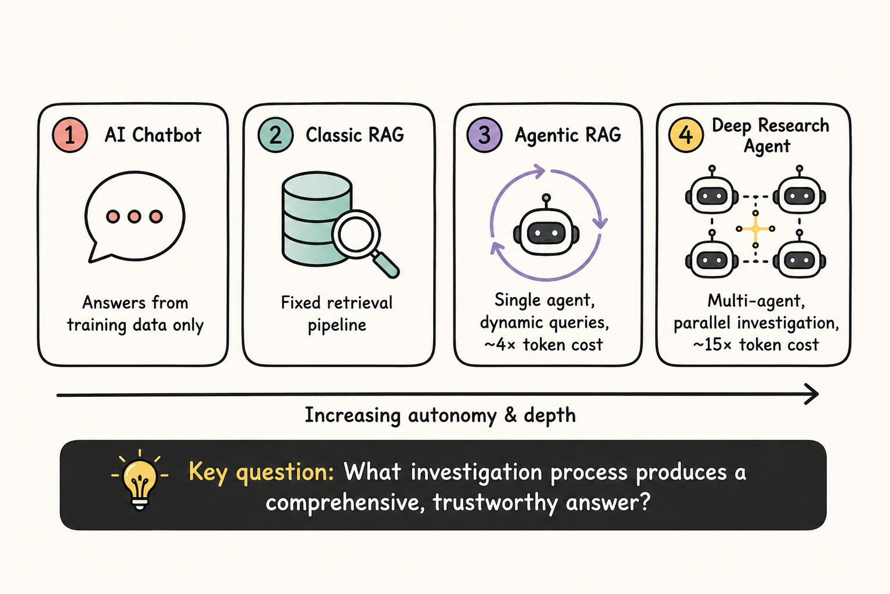
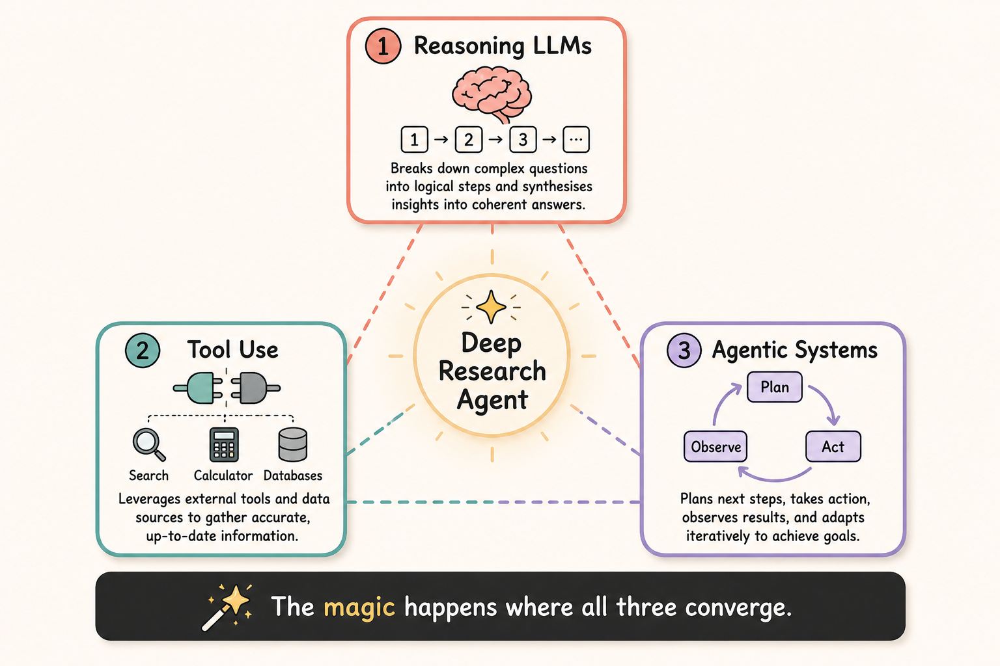
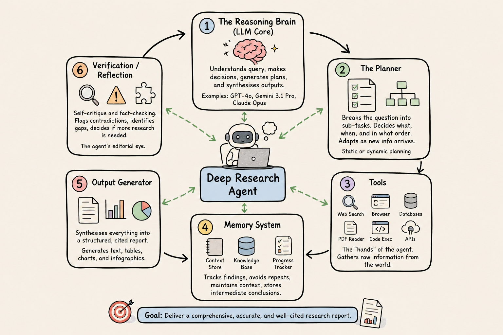
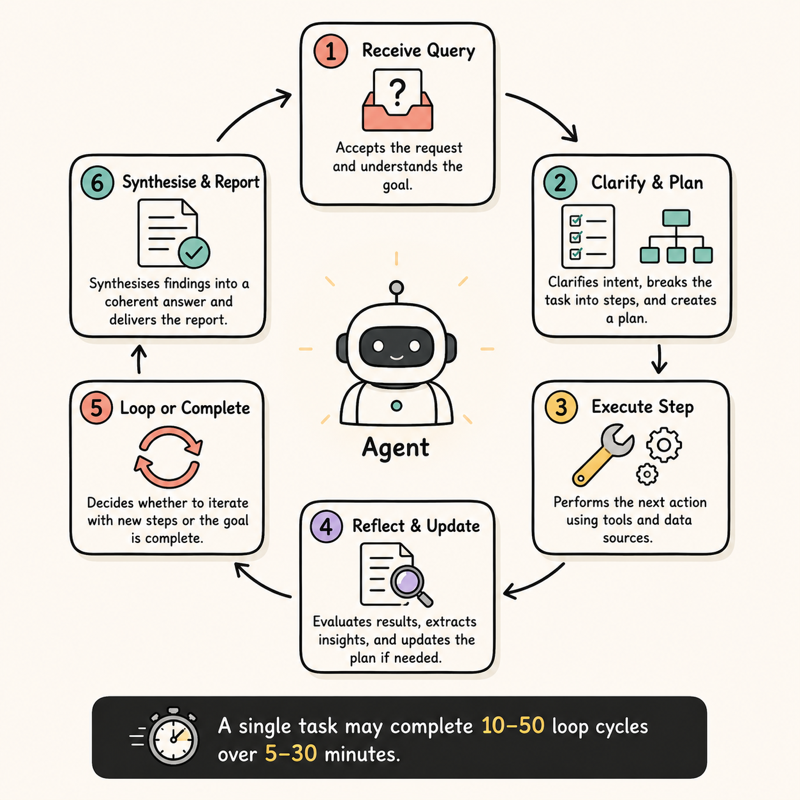
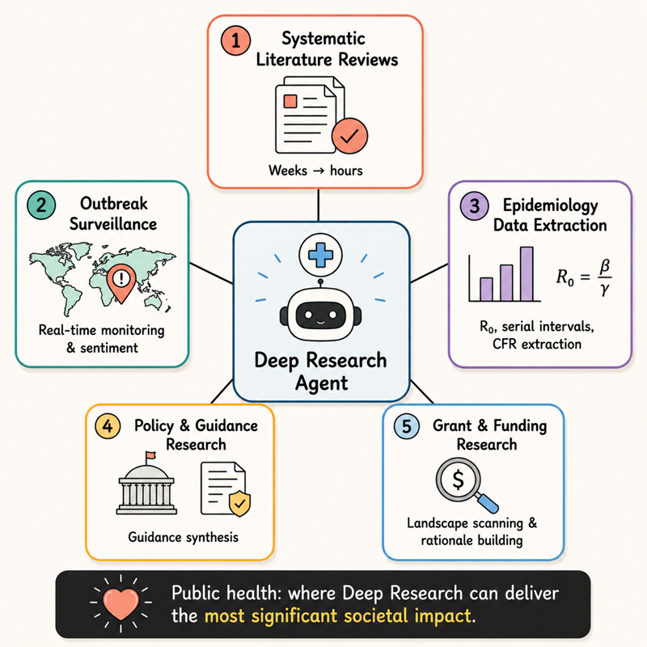

## Table of contents

## Deep Research Agents

Imagine you are a public health professional leading a large HIV program, and you need to answer a genuinely hard question—something like: "What the scientific evidence says about the effectiveness of community-based HIV contact tracing in improving treatment adherence in low-income, rural populations in PEPFAR-supported countries, and what funding and strategies were used in the five most successful use cases?"

A Google search gives you ten blue links. A basic AI chatbot gives you a confident-sounding paragraph that might be half invented. What you really need is something closer to a skilled research assistant: someone who reads and cross-references dozens of sources, follows leads, asks clarifying sub-questions, runs down citations, and then synthesises everything into a structured, cited report.

That is what a Deep Research Agent does (at least, that is the ideal goal).

After the coding agent, deep research has been one of the clearest and most impressive supported use cases of agentic generative AI. Adoption is still not clear, but the promise and potential of deep research are well supported in the literature, including reviews and reports.

In this post, I will explore and explain how it works, along with its potential and promises, by synthesising evidence from multiple systematic reviews and surveys around deep research agents.

**What you will learn:**

1. What a Deep Research Agent is and how it differs from a chatbot or classic RAG system
2. The three converging capabilities — reasoning, tool use, and agentic workflows — that made these agents possible
3. The core architecture: the five components and the iterative research loop
4. The main agent types classified by workflow, data access, and composition
5. Practical use cases across knowledge discovery, business intelligence, content research, and workflow automation
6. Key challenges and limitations to know before deploying in high-stakes settings
7. How public health stands to benefit — and what the CDC and JMIR say about responsible adoption

### Definition

*A Deep Research Agent is an AI system powered by a Large Language Model (LLM) that integrates dynamic reasoning, adaptive long-horizon planning, iterative tool use, and multi-hop information retrieval to autonomously acquire, aggregate, and analyse information from external sources. It ultimately produces comprehensive, structured reports in response to complex, open-ended research tasks.*

In plain language, it is a chatbot that takes your question, breaks it down, and continuously scans and searches the web, browses pages, and queries published scientific paper databases. If it has access, it can also search your surveillance database and pull information from national systems like the census, working for hours until it gathers what it needs and then synthesises it into a compact report.

### How it differs from a regular AI chatbot and Retrieval Augmented Generation (RAG)

A standard AI chatbot mostly uses what it learned during training. Because of that, it usually cannot check new facts, verify calculations, or look up the latest information in real time. A **Deep Research Agent** can do those things by searching external sources, browsing pages, and using tools such as code, databases, and APIs. It can then repeat this process, step by step, to decide what to investigate next until it can answer your question.

Modern chatbots (for example, newer versions of GPT models) can also use external tools like web search and can produce cited reports. This blurs the line between a “chatbot” and “deep research.” The key difference is workflow: general assistants can answer research questions, but Deep Research systems are built for long-horizon research orchestration, with more autonomy and tighter integration of specialized research tools (for example, literature search engines, citation managers, and statistical analysis packages).

Deep Research Agents go beyond traditional **Retrieval-Augmented Generation (RAG)**. Classic RAG often uses a more fixed pipeline, which can struggle with complex, multi-step questions or fast-changing contexts. Deep Research Agents instead combine **dynamic retrieval**, real-time **tool use (TU)**, and **adaptive reasoning** so they can adjust their plan as they learn more.

Agentic RAG and Deep Research represent two distinct points on the same evolutionary spectrum: Agentic RAG operates as a single-agent ReAct loop that dynamically refines queries and adapts its plan step-by-step within one context window, making it well-suited for Q&A, task automation, and real-time lookups at a moderate ~4× token cost; Deep Research, by contrast, treats parallelisation as a core architectural principle, deploying 3–10+ concurrent subagents each with their own context window and independent search trajectory, coordinated by a meta-level orchestrator that synthesises only lightweight references rather than full content — a design that sidesteps context overflow, scales breadth-first investigation across multiple data silos simultaneously, and produces comprehensive cited reports, but at a ~15× token premium that only justifies itself for high-value tasks like strategy, due diligence, and complex literature review. Agentic RAG asks: *"What chunks answer this query?" -* Deep Research asks: *"What investigation process would produce a comprehensive, trustworthy answer to this complex question — and how do I coordinate multiple autonomous sub-investigations to get there?"*

### Background

The Deep Research Agent is the synthesis of three previously separate strands: (1) the reasoning power of large language models, (2) access to external information using tools, and (3) the workflow automation of multi-step agentic systems. The magic happens where all three converge.

**Teaching AI to Think Before It Speaks**. Early language models were essentially advanced autocomplete: they quickly predicted plausible text, but often failed on hard problems because those require working through steps, not just pattern-matching. **LLMs** are trained to reason step-by-step before answering, checking their logic as they go so the final output is more reliable. Research is not a single-step problem. It requires planning ("what do I need to find out?"), evaluation ("is this source credible?"), synthesis ("how do these three conflicting studies fit together?"), and reflection ("have I missed anything important?"). Without genuine reasoning capability, an agent is just a fast Googler. With it, the agent can do the intellectual work of a researcher, not just the retrieval work.

**Tool use**. A raw language model only knows what it learned during training. It cannot look anything up, run a calculation, or check whether something is still true today. **Tool use** lets an AI reach outside its own "mind" and interact with external systems such as a search engine, a calculator, a database, a web browser, or a code interpreter. The mechanism is surprisingly elegant. The LLM is told, in its system instructions, that certain tools exist, described in plain language. For example: *"You have access to a web_search function. Call it by writing `web_search("your query")` and you will receive results."* In 2023, tool use became a standard feature of frontier models, and the Model Context Protocol (MCP), standardised in 2024–2025, made it possible to plug virtually any data source or service into any agent in a universal, secure way.

**Agentic AI system**. A standard AI interaction is a single exchange: you say something, it responds, and it is done. **Agentic AI** breaks this mold entirely. An agent is a system that pursues a *goal* over an extended sequence of actions. It plans what to do, takes an action, observes the result, updates its plan, and continues until the goal is achieved or it decides it cannot be. An agentic AI system does exactly this: it has a goal, it has tools to act on the world, and it has enough autonomy to choose its own sequence of steps.

Here is the cleanest way to see why each strand was necessary but not sufficient on its own:

| Strand alone | What you get | What's still missing |
| --- | --- | --- |
| Tool use only | A system that can call a search API | No ability to reason about what to search for, or what to do with the results |
| Reasoning only | A very smart thinker working from memory | No access to current information; can only reason about what it already knows |
| Agentic systems only | A loop that can plan and act | Without reasoning, the plans are shallow; without tools, the actions are just text generation |
| All three together | **A Deep Research Agent** | — |

The moment a single system could *reason* about a complex goal, *plan* a multi-step approach to investigating it, and *act* by calling real tools to retrieve live information — and then loop through that cycle adaptively — the Deep Research Agent was born. Not as a single invention, but as an emergence from three converging capabilities finally mature enough to work together.

## How They Work: Core Architecture

Breaking open a Deep Research Agent reveals a sophisticated system of interconnected components. Think of it as a research laboratory rather than a single piece of software — with different specialists working in coordination. Imagine a well-run newsroom. The editor (the LLM brain) decides what stories to pursue. Reporters (search & retrieval tools) go out and gather information. A fact-checker (verification module) scrutinises the claims. A data journalist (code execution) runs the numbers. The layout team (output generation) turns it all into a clean article. The Deep Research Agent is the entire newsroom — automated and running at digital speed.

### The Five Core Components

1. **The Reasoning Brain (LLM Core)** — The central large language model that understands the query, makes decisions, generates plans, and synthesises final outputs. This is the "thinking" layer — typically a frontier model like GPT-4o, Gemini 3.1 Pro, or Claude Opus.
2. **The Planner** — Breaks the original research question into a structured sequence of sub-tasks. Decides what needs to be found, in what order, and how findings from one step should inform the next. Can be static (pre-defined tree) or dynamic (adapts as new information arrives).
3. **Information Acquisition Tools** — The "hands" of the agent: web search APIs, browser automation, database queries, PDF readers, code executors, and API connectors. The agent invokes these tools as needed to gather raw information from the world.
4. **Memory System** — Tracks what has been found so far, avoids redundant searches, maintains research context across dozens of steps, and stores intermediate conclusions. Without this, the agent would be lost in its own investigation.
5. **Output Generator** — Synthesises all gathered information into a coherent, structured, cited report. Modern agents can generate text, charts, tables, and infographics inline — producing a deliverable suitable for professional use.
6. **Verification / Reflection** — Self-critique module that reviews its own findings for consistency, flags contradictions, identifies gaps, and decides whether additional research is needed before finalising the report. The agent's "editorial eye."

### The Research Loop

What makes Deep Research Agents fundamentally different from a single-turn AI response is the iterative research loop. Rather than answering immediately, the agent cycles through a process:

- Receive query— understand what is being asked, including implicit sub-questions
- Clarify & plan— optionally ask clarifying questions; decompose the query into a research plan
- Execute step— use a tool (web search, code, database) to gather information for one sub-task
- Reflect & update— evaluate what was found; update the research plan if needed
- Loop or complete— return to step 3 until all sub-tasks are addressed, then synthesise
- Synthesise & generate report— produce structured, cited output

A single research task may complete 10–50 of these loop cycles. OpenAI's Deep Research is known to run for 5–30 minutes on complex queries, executing dozens of searches in the background.

## Architecture and Types of Deep Research Agents

The field has evolved a rich taxonomy of agent types, classified by their architecture, data access patterns, and intended use cases.

### By Workflow Architecture

#### Static / Tree-Based Agents

These agents execute a fixed, pre-planned research tree defined by configurable parameters like "depth" (how many follow-up questions to pursue) and "breadth" (how many parallel threads to explore per level). They are highly reproducible and efficient, making them suitable for compliance-driven or auditable research tasks. The Static-DRA system (Google, December 2025) exemplifies this approach, offering users explicit control over research intensity.

#### Dynamic / Adaptive Agents

These agents rewrite their own research plan as they go, based on what they discover. If an early search reveals that the most relevant data is in clinical trial registries rather than academic papers, the agent pivots accordingly. OpenAI's Deep Research, Perplexity's system, and most frontier agents use dynamic workflows.

#### Reinforcement Learning-Trained Agents

The most cutting-edge class, exemplified by **DeepResearcher** (2025), trains agents directly in real-world web environments using reinforcement learning. Rather than being hand-coded with search strategies, the agent learns through trial and error which actions lead to better research outcomes. This produces agents that handle the "noisy, unstructured, and dynamic nature of the open web" far more robustly than rule-based counterparts.

### By Data Access Strategy

#### Open-Web Agents

Default agents that search the public internet. Suitable for general knowledge tasks, policy research, market analysis, and literature synthesis from publicly available sources.

#### Closed-Domain / Private Data Agents

Agents connected to proprietary databases, internal document repositories, or gated data sources. With the advent of the Model Context Protocol (MCP) in 2025, organisations can now securely plug their private data into frontier research agents without exposing sensitive information to the public internet.

#### Hybrid Agents

The most powerful class: agents that fuse open web research with private organisational data. Google's newly launched Deep Research Max (April 2026) represents this archetype — capable of simultaneously searching the web, querying a company's internal systems, and reading uploaded documents within a single research task.

### By Agent Composition

| Type | Description | Best For | Speed |
| --- | --- | --- | --- |
| Single-Agent | One LLM executing all research tasks sequentially | Focused, well-scoped queries | Moderate |
| Multi-Agent (Hierarchical) | Coordinator + specialised sub-agents | Complex, multi-domain investigations | Fast (parallel) |
| Swarm | Many peer agents collaborating without a central coordinator | Exploratory research with high uncertainty | Very fast |
| Supervisor-Worker | A supervisor assigns tasks to worker agents based on capability | Scientific discovery with specialised tools | Fast |

### By General vs. Domain-Specific Agents

One of the most important distinctions in the field — with profound practical implications — is the difference between agents designed to research anything and agents optimised for a specific domain.

#### General-Purpose Agents

Products like OpenAI's Deep Research, Google's Deep Research Max, Perplexity, and Claude Research are built to handle virtually any topic — from synthesising academic papers to analysing market trends to answering complex policy questions. Their strength is flexibility: a single system can investigate climate science, antitrust law, and pharmaceutical trials without reconfiguration.

The trade-off is depth. General agents lack specialised knowledge databases, domain-specific terminology handling, and professional-grade validation that experts in a given field require. A cardiologist reading a general agent's synthesis of new heart failure data may find it superficial compared to what a cardiology-trained agent could produce.

#### Domain-Specific Agents

These agents are fine-tuned or architecturally specialised for a particular field. Examples span biology (agents fine-tuned on genomics literature), law (agents with access to legal databases), finance (agents connected to Bloomberg, FactSet, SEC filings), and medical research (agents that understand clinical trial design, PICO frameworks, and statistical reporting).

## Practical Implications & Use Cases

A useful way to organise these is around the *type of work* being automated — what the agent is fundamentally doing, not just where it is being used. Below is a reorganised and expanded framework across four domains.

**I. Intelligent Knowledge Discovery.** Deep Research Agents are strongest when the core job is finding and synthesising scattered knowledge, especially across academic and grey literature. They can help run structured evidence workflows like systematic, scoping, and rapid reviews by searching widely, extracting key findings, and comparing results across studies. They can also support higher-level discovery by surfacing patterns, generating hypotheses, and mapping where evidence is missing.

- Systematic literature reviews
- Scoping and rapid evidence reviews
- Hypothesis generation and pattern recognition
- Knowledge gap mapping
- Distilling grey literature

**II. Market & Business Intelligence.** In business settings, these agents function like accelerated analysts that continuously gather and integrate information from many sources. They can map a market, profile competitors, monitor pricing changes, and connect signals across filings, news, and industry reports. When used for due diligence and policy monitoring, they help teams identify risks and opportunities faster than manual research.

- Market landscape analysis
- Competitive and pricing intelligence
- Deep industry research and investment due diligence
- Regulatory and policy scanning

**III. Content & Communication Research.** For writers, communicators, and policy teams, deep research is most valuable as the evidence-building layer before drafting. The agent can assemble statistics, case studies, expert viewpoints, and background context that make content more accurate and persuasive. It can also track public narratives and sentiment to support messaging decisions and identify emerging misinformation or reputational risks.

- Background research for articles and reports
- Social media and narrative intelligence
- Investigative research
- Messaging and communications research

**IV. End-to-End Workflow Automation.** Some use cases extend beyond research into orchestrating an entire pipeline from question to actionable output. Agents can combine literature review, data collection, analysis, and interpretation in a single loop, which supports workflows like scientific discovery, clinical trial tracking, and continuous surveillance. They are also useful for funding work by scanning grant landscapes, extracting requirements, and building evidence-backed rationales.

- Scientific discovery pipelines
- Clinical trial intelligence
- Continuous surveillance and monitoring
- Grant writing and funding research

**V. Collaborative Intelligence Enhancement.** In many high-stakes domains, the best model is a partnership where the agent expands what experts can cover, while humans retain judgment and accountability. Deep Research Agents can provide daily briefings, structured comparisons, and scenario analyses that help decision-makers act faster and with more context. Human-in-the-loop approaches also make it easier to steer the investigation, validate conclusions, and align outputs with real-world constraints and equity goals.

- Expert augmentation
- Human-in-the-loop research
- Equity and access democratisation
- Decision support and scenario analysis

## Challenges & Limitations

Deep Research Agents are powerful, but not safe to use uncritically in high-stakes settings.

### General-Purpose Agents

- **Hallucinations**: Confident errors can slip in and then compound across long research chains.
- **Source quality**: The open web includes noise, bias, and misinformation, and agents can mis-rank credibility.
- **Inefficiency**: Many tasks are naturally parallel, but orchestration overhead can still make runs slow.
- **Evaluation gaps**: Benchmarks often test single-turn Q&A, not multi-step research quality.
- **Cost**: Dozens of searches and long reasoning traces can be expensive at scale.

### Domain-Specific Agents

- **Data scarcity**: High-quality, domain-curated data for tuning is often limited or inaccessible.
- **Privacy and governance**: Sensitive data and unclear ownership and compliance requirements raise risk.
- **Knowledge staleness**: Fast-moving fields can outdate fine-tuned models quickly.
- **Liability**: Accountability for harmful errors remains legally unclear.

### Practical Guardrail

In regulated domains, treat outputs as *draft research* and require human expert review before decisions.

## Public Health: A Deep Dive Into Applications

Public health may be the field where Deep Research Agents can deliver the most significant societal impact — and where the highest stakes demand the most careful deployment. It is a domain defined by vast complexity, time-sensitive decisions, heterogeneous data sources, and the ever-present imperative that errors cost lives.

In March 2026, the CDC published formal guidance for state, tribal, local, and territorial (STLT) public health agencies on how to use Deep Research tools — a landmark acknowledgment that these systems are now operational tools in the public health arsenal, not hypothetical future technologies.

Public health is like trying to solve a jigsaw puzzle where the pieces are scattered across thousands of filing cabinets in different languages, some of the pieces are missing, and the final picture keeps changing. A Deep Research Agent doesn't solve the puzzle for you — but it can gather and sort the pieces dramatically faster than any human team could, leaving experts free to focus on the interpretive, judgmental work that actually requires human wisdom.

The **AgentSLR** system(2026) demonstrates automated systematic literature reviews in epidemiology — extracting key parameters like basic reproduction numbers, serial intervals, and case-fatality ratios from published literature. What previously took a team of epidemiologists weeks to compile now takes hours. For emerging diseases like a novel influenza variant or the next coronavirus, that time compression is genuinely life-saving.

The CDC's own evaluation found Deep Research tools well-suited to tasks like: "Provide a summary of recent news articles highlighting outbreaks of infectious diseases within the United States, noting regions affected and the severity of each case, and explore local sentiment around each outbreak.”

**The JMIR Assessment (March 2026)** A landmark paper in the *Journal of Medical Internet Research* concluded that deep research agents should be embraced as "assistive research tools rather than pseudoexperts." Their value lies in accelerating information gathering, not replacing rigorous human judgment. Realising their potential requires transparent retrieval architectures, robust benchmarking, and explicit educational integration to preserve clinicians' evaluative reasoning.

## Where This Is Going

Deep Research Agents in 2026 are not the finished article — they are a rapidly maturing technology moving through its most consequential phase. The fundamental capabilities are proven. The trust, governance, and integration frameworks are still being built.

For public health in particular, the potential is exceptional. A field defined by resource constraints, information overload, and life-or-death decisions stands to benefit enormously from systems that can synthesise evidence at machine speed. The CDC's institutional embrace of these tools as legitimate operational aids is a significant signal: this technology is past proof-of-concept and into deployment.

The key insight that should guide adoption is the one the JMIR articulated most clearly: these are *research assistants, not authorities*. They accelerate the information-gathering phase of expert work. They do not replace the expert judgment, contextual wisdom, and ethical accountability that must remain with human professionals — especially in health, law, and policy.

The agent gathers. The human decides. That partnership, properly structured, may be one of the most powerful tools public health has ever had.

**Final Thought**
The Deep Research Agent is best understood not as artificial intelligence replacing human intelligence, but as a new kind of research infrastructure — like the library, or the internet, or the scientific journal — that expands the range of questions that humans can pursue and the speed at which they can pursue them. The questions themselves, and what to do with the answers, remain irreducibly human.

## References

### Academic Papers & Preprints (arXiv)

**Deep Research Agents: A Systematic Examination and Roadmap**
Huang et al., arXiv, 2025
[Read →](https://arxiv.org/abs/2506.18096)

**A Comprehensive Survey of Deep Research: Systems, Methodologies, and Applications**
Xu & Peng, Zhejiang University, arXiv, 2025
[Read →](https://arxiv.org/abs/2506.12594)

**Deep Research of Deep Research: From Transformer to Agent, From AI to AI for Science**
arXiv, 2026
[Read →](https://arxiv.org/abs/2603.28361)

**DeepResearcher: Scaling Deep Research via Reinforcement Learning in Real-world Environments**
Zheng et al., arXiv, 2025
[Read →](https://arxiv.org/abs/2504.03160)

**A Hierarchical Tree-based Approach for Creating Configurable and Static Deep Research Agent (Static-DRA)**
Prateek, Google, arXiv, December 2025
[Read →](https://arxiv.org/abs/2512.03887)

**MA-RAG: Multi-Agent Retrieval-Augmented Generation via Collaborative Chain-of-Thought Reasoning**
Nguyen et al., arXiv, 2025
[Read →](https://arxiv.org/abs/2505.20096)

**Agentic Retrieval-Augmented Generation: A Survey on Agentic RAG**
Ehtesham et al., arXiv, 2025–2026
[Read →](https://arxiv.org/abs/2501.09136)

**Why Your Deep Research Agent Fails? On Hallucination Evaluation in Full Research Trajectory**
Zhan et al., arXiv, January 2026
[Read →](https://arxiv.org/abs/2601.22984)

**Rethinking the AI Scientist: Interactive Multi-Agent Workflows for Scientific Discovery**
arXiv, 2026
[Read →](https://arxiv.org/abs/2601.12542)

**AgentSLR: Automating Systematic Literature Reviews in Epidemiology with Agentic AI**
arXiv, 2026
[Read →](https://arxiv.org/abs/2603.22327)

**AI Agents in Drug Discovery**
arXiv, 2025
[Read →](https://arxiv.org/abs/2510.27130)

**Reasoning RAG via System 1 or System 2: A Survey on Reasoning Agentic Retrieval-Augmented Generation for Industry Challenges**
arXiv, 2025
[Read →](https://arxiv.org/abs/2506.10408)

---

### Government & Public Health Institutions

**Considerations for Agentic Research in Public Health**
CDC, March 12, 2026
[Read →](https://www.cdc.gov/ai/resources/considerations-for-agentic-research-in-public-health.html)

---

### Medical & Health Journals

**Deep Research Agents: Major Breakthrough or Incremental Progress for Medical AI?**
Journal of Medical Internet Research (JMIR), March 26, 2026
[Read →](https://www.jmir.org/2026/1/e88195)

**Artificial Intelligence and Infectious Diseases: An Evidence-Driven Conceptual Framework for Research, Public Health, and Clinical Practice**
The Lancet Infectious Diseases, September 2025
[Read →](https://www.thelancet.com/journals/laninf/article/PIIS1473-3099(25)00412-8/abstract)

**AI-Driven Epidemiology: The Next Frontier in Precision Public Health**
Prema, WIREs Data Mining and Knowledge Discovery, Wiley, 2026
[Read →](https://wires.onlinelibrary.wiley.com/doi/10.1002/widm.70077)

**Harnessing Artificial Intelligence for Enhanced Public Health Surveillance: A Narrative Review**
Frontiers in Public Health, July 2025
[Read →](https://www.frontiersin.org/journals/public-health/articles/10.3389/fpubh.2025.1601151/full)

**Artificial Intelligence in Early Warning Systems for Infectious Disease Surveillance: A Systematic Review**
Frontiers in Public Health, June 2025
[Read →](https://www.frontiersin.org/journals/public-health/articles/10.3389/fpubh.2025.1609615/full)

**Artificial Intelligence in Epidemic Watch: Revolutionizing Infectious Diseases Surveillance**
Frontiers in Digital Health, December 2025
[Read →](https://www.ncbi.nlm.nih.gov/pmc/articles/PMC12711821/)

**The Role and Limitations of Artificial Intelligence in Combating Infectious Disease Outbreaks**
Cureus, January 2025
[Read →](https://www.ncbi.nlm.nih.gov/pmc/articles/PMC11800715/)

**Agentic AI and Large Language Models in Radiology: Opportunities and Hallucination Challenges**
PMC, 2025
[Read →](https://www.ncbi.nlm.nih.gov/pmc/articles/PMC12729288/)

**A State-of-the-Art Review of AI Applications in Healthcare: Advances in Diabetes, Cancer, Epidemiology, and Mortality Prediction**
Computers, MDPI, April 2025
[Read →](https://www.mdpi.com/2073-431X/14/4/143)

---

### Industry & Technology Sources

**Deep Research Max: A Step Change for Autonomous Research Agents**
Google DeepMind Blog, April 21, 2026
[Read →](https://blog.google/innovation-and-ai/models-and-research/gemini-models/next-generation-gemini-deep-research/)

**Deep Research Max Preview — Gemini API Documentation**
Google AI for Developers, April 21, 2026
[Read →](https://ai.google.dev/gemini-api/docs/models/deep-research-max-preview-04-2026)

**Google's New Deep Research and Deep Research Max Agents Can Search the Web and Your Private Data**
VentureBeat, April 2026
[Read →](https://venturebeat.com/technology/googles-new-deep-research-and-deep-research-max-agents-can-search-the-web-and-your-private-data)

**The AI Research Landscape in 2026: From Agentic AI to Embodiment**
Adaline Labs, January 2026
[Read →](https://labs.adaline.ai/p/the-ai-research-landscape-in-2026)

**Deep|LLM 2026: From the Illusion of Model Development Stagnation to Large-Scale Real-World Agent Deployment**
FundaAI Substack, January 2026
[Read →](https://fundaai.substack.com/p/deepllm-2026-from-the-illusion-of)

**The Trends That Will Shape AI and Tech in 2026**
IBM Think, March 2026
[Read →](https://www.ibm.com/think/news/ai-tech-trends-predictions-2026)

**Health and Life Sciences in 2026: Data Earns Its Doctorate and AI Prescribes the Future of Care**
SAS, December 2025
[Read →](https://www.sas.com/en_us/news/press-releases/2025/december/health-life-sciences-2026-predictions.html)

**Best Deep Research AI Tools in 2026: Tested and Compared**
Barie.ai, 2026
[Read →](https://barie.ai/blog/best-deep-research-ai-tools-in-2026-tested-and-compared/)

**AI Hallucination Statistics: Research Report 2026**
Suprmind, 2026
[Read →](https://suprmind.ai/hub/insights/ai-hallucination-statistics-research-report-2026/)

**Latest AI Research (Dec 2025): GPT-5, Agents & Trends**
IntuitionLabs, December 2025
[Read →](https://intuitionlabs.ai/articles/latest-ai-research-trends-2025)