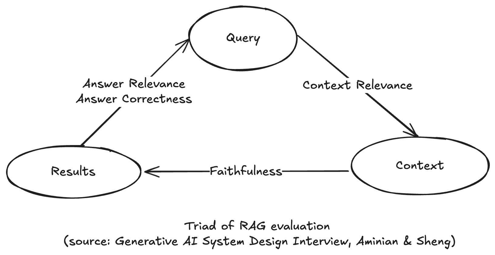

## Table of contents

## Why This Post?

Building RAG systems is one thing—knowing if they actually work is another. This guide shows you how to properly evaluate a multi-agent RAG system using real benchmarks and metrics that matter.

**Why evaluation matters for RAG:** Without rigorous evaluation, you're flying blind. RAG systems can hallucinate, miss relevant information, or provide correct-sounding but inaccurate answers. Systematic evaluation using established metrics helps you measure performance objectively and identify areas for improvement.

## What We're Building

This notebook evaluates a multi-agent RAG system inspired by [PaperQA](https://arxiv.org/abs/2312.07559) (L'ala et al., 2023). The system uses three specialized agents:
- **Orchestrator** - coordinates the workflow
- **Evidence Agent** - scores and summarizes retrieved content
- **Answer Agent** - synthesizes final responses

We test this search-gather-respond workflow on the PubMedQA dataset using RAGAS evaluation metrics to measure performance across multiple dimensions.

**What we evaluate:**
- **Answer accuracy** - Does the system get yes/no questions right?
- **Context relevance** - Are we retrieving the right information?
- **Faithfulness** - Does the answer stick to the source material?
- **Answer correctness** - How similar are answers to expert labels?

**Why PubMedQA?** It provides 1K expert-labeled medical questions with ground truth answers. This makes it ideal for benchmarking because we can compare our system's outputs against human expert annotations.


```python
%load_ext autoreload
%autoreload 2
```


```python
from datasets import load_dataset
import pandas as pd
import numpy as np
from vectorstore import VectorStoreAbstract
from rag_agent import  AgentConfig,AgenticRAG
from ragas.dataset_schema import SingleTurnSample,EvaluationDataset
from ragas import evaluate
from ragas.metrics import (
    AnswerCorrectness,
    Faithfulness,
    ExactMatch,
    LLMContextPrecisionWithReference
)
from ragas.run_config import RunConfig
from IPython.display import Markdown, display
```

## 1. Load PubMedQA Dataset

First, we need data to evaluate against. PubMedQA is perfect because it includes both questions and expert-verified answers.

**About the dataset:**

[PubMedQA](https://arxiv.org/abs/1909.06146) contains medical research questions that require yes/no/maybe answers based on paper abstracts. Each question is paired with:
- The source abstract (context)
- A detailed explanation (long answer)
- A final decision (yes/no/maybe)

Example: *"Do preoperative statins reduce atrial fibrillation after coronary artery bypass grafting?"*

This structure allows us to evaluate both short-form (yes/no) and long-form (detailed explanation) answers.

Dataset: https://huggingface.co/datasets/qiaojin/PubMedQA


```python
# or load the separate splits if the dataset has train/validation/test splits
_dataset = load_dataset("qiaojin/PubMedQA",'pqa_labeled')
```

**Data filtering:**

We filter to yes/no questions only (removing "maybe" answers) because:
1. Binary classification is easier to evaluate objectively
2. It provides clearer performance metrics
3. Most real-world applications need definitive answers


```python

pqa_lbl = pd.DataFrame(_dataset['train'])
pqa_lbl_yes_no = pqa_lbl.loc[pqa_lbl['final_decision'].isin(['yes','no'])].copy()
pqa_lbl_yes_no['abstract'] = pqa_lbl_yes_no['context'].apply(lambda x: " ".join(x['contexts']))
pqa_lbl_yes_no['context_list'] = pqa_lbl_yes_no['context'].apply(lambda x: x['contexts'])

```


```python
#pqa_lbl_yes_no.to_csv("pqa_raw.csv")
```

## 2. Create Test Sample

For this demonstration, we sample 5 questions with a fixed random seed for reproducibility. In production, you'd want a larger test set (50-100+ samples) for statistical significance.


```python
# Sample with a fixed random state for reproducibility
sample_df_1 = pqa_lbl_yes_no.sample(n=5, random_state=42)
sample_df_1[['pubid','abstract','question','context_list','long_answer','final_decision']]
data_articles = sample_df_1[['pubid','abstract','question','context_list','long_answer','final_decision']].copy().reset_index(drop=True)
samples_abstracts = [v for k,v in data_articles.T.to_dict().items()]

```


```python
samples_abstracts[0]
```


    {'pubid': 21569408,
     'abstract': 'A growing body of research emphasizes the importance of contextual factors on health outcomes. Using postcode sector data for Scotland (UK), this study tests the hypothesis of spatial heterogeneity in the relationship between area-level deprivation and mortality to determine if contextual differences in the West vs. the rest of Scotland influence this relationship. Research into health inequalities frequently fails to recognise spatial heterogeneity in the deprivation-health relationship, assuming that global relationships apply uniformly across geographical areas. In this study, exploratory spatial data analysis methods are used to assess local patterns in deprivation and mortality. Spatial regression models are then implemented to examine the relationship between deprivation and mortality more formally. The initial exploratory spatial data analysis reveals concentrations of high standardized mortality ratios (SMR) and deprivation (hotspots) in the West of Scotland and concentrations of low values (coldspots) for both variables in the rest of the country. The main spatial regression result is that deprivation is the only variable that is highly significantly correlated with all-cause mortality in all models. However, in contrast to the expected spatial heterogeneity in the deprivation-mortality relationship, this relation does not vary between regions in any of the models. This result is robust to a number of specifications, including weighting for population size, controlling for spatial autocorrelation and heteroskedasticity, assuming a non-linear relationship between mortality and socio-economic deprivation, separating the dependent variable into male and female SMRs, and distinguishing between West, North and Southeast regions. The rejection of the hypothesis of spatial heterogeneity in the relationship between socio-economic deprivation and mortality complements prior research on the stability of the deprivation-mortality relationship over time.',
     'question': 'Does context matter for the relationship between deprivation and all-cause mortality?',
     'context_list': ['A growing body of research emphasizes the importance of contextual factors on health outcomes. Using postcode sector data for Scotland (UK), this study tests the hypothesis of spatial heterogeneity in the relationship between area-level deprivation and mortality to determine if contextual differences in the West vs. the rest of Scotland influence this relationship. Research into health inequalities frequently fails to recognise spatial heterogeneity in the deprivation-health relationship, assuming that global relationships apply uniformly across geographical areas. In this study, exploratory spatial data analysis methods are used to assess local patterns in deprivation and mortality. Spatial regression models are then implemented to examine the relationship between deprivation and mortality more formally.',
      'The initial exploratory spatial data analysis reveals concentrations of high standardized mortality ratios (SMR) and deprivation (hotspots) in the West of Scotland and concentrations of low values (coldspots) for both variables in the rest of the country. The main spatial regression result is that deprivation is the only variable that is highly significantly correlated with all-cause mortality in all models. However, in contrast to the expected spatial heterogeneity in the deprivation-mortality relationship, this relation does not vary between regions in any of the models. This result is robust to a number of specifications, including weighting for population size, controlling for spatial autocorrelation and heteroskedasticity, assuming a non-linear relationship between mortality and socio-economic deprivation, separating the dependent variable into male and female SMRs, and distinguishing between West, North and Southeast regions. The rejection of the hypothesis of spatial heterogeneity in the relationship between socio-economic deprivation and mortality complements prior research on the stability of the deprivation-mortality relationship over time.'],
     'long_answer': 'The homogeneity we found in the deprivation-mortality relationship across the regions of Scotland and the absence of a contextualized effect of region highlights the importance of taking a broader strategic policy that can combat the toxic impacts of socio-economic deprivation on health. Focusing on a few specific places (e.g. 15% of the poorest areas) to concentrate resources might be a good start but the impact of socio-economic deprivation on mortality is not restricted to a few places. A comprehensive strategy that can be sustained over time might be needed to interrupt the linkages between poverty and mortality.',
     'final_decision': 'no'}


## 3. Build Vector Store

Before our agents can answer questions, we need to index the paper abstracts for semantic search. This involves three steps: initialization, chunking, and embedding creation.

### 3.1 Initialize ChromaDB

We use ChromaDB as our vector database because it's lightweight, supports persistence, and works well for prototyping. Set `RECREATE_INDEX=False` to reuse existing indices between runs.


```python
from vectorstore import VectorStoreAbstract
RECREATE_INDEX = False

# Set up ChromaDB client
CHROMA_PERSIST_DIRECTORY="./corpus-data/chroma_db"
vector_store = VectorStoreAbstract(abstracts= samples_abstracts,
                 persist_directory=CHROMA_PERSIST_DIRECTORY,
                 recreate_index=RECREATE_INDEX)

# Display index status
if vector_store.index_exists:
    doc_count = vector_store.get_document_count()
    print(f"Index contains {doc_count} document chunks")
else:
    print("No existing index found")
```

    Creating new index at ./cdc-corpus-data/chroma_db
    No existing index found


### 3.2 Split Abstracts into Chunks

**Why chunk?** Abstracts can be long, but embedding models work best with shorter, focused segments. We split text into smaller chunks (100 chars, 20 overlap) to:
- Improve retrieval precision
- Reduce noise in context
- Enable more granular relevance scoring


```python
%%time
# Only chunk documents if we need to recreate the index
if vector_store.should_process_documents():
    print("Chunking documents...")
    documents = vector_store.chunking()
    print(f"Created {len(documents)} document chunks")
else:
    print("Skipping document chunking (using existing index)")
    documents = []
```

    Chunking documents...


    Chunking documents: 100%|██████████| 5/5 [00:00<00:00, 4460.13article/s]

    Created 116 document chunks
    CPU times: user 2.08 ms, sys: 1.34 ms, total: 3.42 ms
    Wall time: 2.77 ms


    


### 3.3 Create Vector Embeddings

We use HuggingFace's `all-MiniLM-L6-v2` model because:
- Fast inference (important for prototyping)
- Good balance of quality and speed
- Works well for medical/scientific text

Each chunk gets converted to a dense vector representation that captures semantic meaning.


```python
%%time
# Only index documents if we need to recreate the index
if vector_store.should_process_documents():
    print(f"Indexing {len(documents)} documents (this may take several minutes)...")
    vector_store.index_document(documents)  # Using subset for demo
    print("Indexing completed!")
else:
    print("Skipping document indexing (using existing index)")
    print("Ready to perform searches!")
```

    Indexing 116 documents (this may take several minutes)...


    Creating embeddings: 100%|██████████| 116/116 [00:00<00:00, 191.29doc/s]

    Indexing completed!
    CPU times: user 270 ms, sys: 145 ms, total: 414 ms
    Wall time: 608 ms


    


## 4. Run Agentic RAG

Now we configure and test our multi-agent system. The agents work together in a workflow:
1. **Search** - Find relevant paper chunks
2. **Gather** - Score and filter evidence (threshold: 8/10)
3. **Answer** - Synthesize a response from high-quality evidence

The system can iterate up to 3 times if it needs more information.


```python
config = AgentConfig(
        collection_filter='pcd',
        relevance_cutoff=8,
        search_k=10,
        max_evidence_pieces=8,
        max_search_attempts=3,
        mc_final_decision_only= False,
        verbose = True
    )

    # Initialize agentic RAG
agentic_rag = AgenticRAG(vector_store=vector_store,config=config)

 
async def ask(config:AgentConfig,agent:AgenticRAG,question:str):

    # Ask question
    #question = "Causes of sleep disorder"
    print(f"Question: {question}\n")
    answer = await agentic_rag.ask_question(question, max_turns=10)

    return answer
```


```python
question = "Does context matter for the relationship between deprivation and all-cause mortality?"
#question = "What are the most common methods used in diabetes prevention to support adolescents in rural areas in the US?"
answer, context = await ask(config=config,agent = agentic_rag, question=question)
```

    Question: Does context matter for the relationship between deprivation and all-cause mortality?
    
    🟢 [Search] Starting paper search for question:Does context matter for the relationship between deprivation and all-cause mortality?
    🟢 [Search] Paper search returned 10 passages from papers
    🟢 [Status] Paper Count=10 | Relevant Papers=0 Current Evidence=0
    🟢 [Gather] Gathering evidence for question: Does context matter for the relationship between deprivation and all-cause mortality?
    🟢 [Gather] Finished gathering evidence for question: Does context matter for the relationship between deprivation and all-cause mortality?
    {'Paper': 10, 'Relevant': 7, 'Evidence': 7}
    🟢 [Search] Starting paper search for question:contextual factors deprivation all-cause mortality studies
    🟢 [Search] Paper search returned 10 passages from papers
    🟢 [Status] Paper Count=20 | Relevant Papers=7 Current Evidence=7
    🟢 [Search] Starting paper search for question:social determinants context deprivation mortality relationship
    🟢 [Search] Paper search returned 10 passages from papers
    🟢 [Status] Paper Count=30 | Relevant Papers=7 Current Evidence=7
    🟢 [Gather] Gathering evidence for question: contextual factors deprivation all-cause mortality studies
    🟢 [Gather] Finished gathering evidence for question: contextual factors deprivation all-cause mortality studies
    {'Paper': 30, 'Relevant': 28, 'Evidence': 28}
    🟡 [Answer] Generating answer based on 28 pieces of evidence...
    🟢 [Answer] Answer generated successfully


```python
print(f"\nFinal Answer: {answer}")
```

    
    Final Answer: Yes, context significantly influences the relationship between deprivation and all-cause mortality. Key factors include geographical location, socioeconomic conditions, and access to healthcare, which can alter how deprivation affects mortality rates. The evidence suggests a non-linear relationship, indicating that the impact of deprivation varies across different settings and populations, underscoring the complexity of this dynamic.
    
    Understanding these contextual elements is essential for accurately analyzing the deprivation-health relationship and for developing targeted public health strategies and interventions. Thus, the significance of context is critical in shaping the outcomes related to deprivation and all-cause mortality.


## 5. Evaluate Performance

This is where we measure how well our system actually works. We run two types of evaluations to assess different aspects of performance.

### RAGAS Evaluation Framework

**What is RAGAS?**

RAGAS (Retrieval Augmented Generation Assessment) provides reference-free metrics for evaluating RAG systems. Traditional evaluation requires expensive human annotations. RAGAS uses LLMs to automatically assess quality across multiple dimensions.

**Why RAGAS?**
- Automated evaluation at scale
- Comprehensive metrics covering retrieval and generation
- Proven correlation with human judgments

Reference: Shahul, ES et al. "RAGAS: Automated Evaluation of Retrieval Augmented Generation." EACL (2023).

Learn more: https://www.ragas.io/


```python
import os
import openai
from dotenv import load_dotenv

load_dotenv(override=True)
os.environ["OPENAI_API_KEY"] =  os.getenv("OPENAI_API_KEY")
openai_client = openai.OpenAI()
```

### Triad of RAG Evaluation

Evaluating a RAG system focuses on four key aspects:

- Context Relevance, which includes common metrics (Hit Rate, Mean Reciprocal Rank (MRR), Normalized Discounted Cumulative Gain (nDCG), and Context Precision)
- Faithfulness
- Answer Relevance
- Answer Correctness



  
### Selected Metrics Explained

We evaluate four key metrics:

**1. ExactMatch** (similar to Answer Correctness)
- Measures: Binary accuracy for yes/no questions
- Why it matters: Direct measure of decision correctness
- Range: 0-1 (higher is better)

**2. Context Precision**
- Measures: Relevance of retrieved passages to the question
- Why it matters: Validates your retrieval system is finding the right information
- Range: 0-1 (higher is better)

**3. Faithfulness**
- Measures: Whether the answer is grounded in the retrieved context
- Why it matters: Detects hallucinations—answers must stick to source material
- Range: 0-1 (higher is better)

**4. Answer Correctness**
- Measures: Semantic similarity between generated and ground truth answers
- Why it matters: Evaluates quality of long-form explanations
- Range: 0-1 (higher is better)

### 5.1 Evaluate Binary Answer (Yes/No)

First, we test how well the system answers yes/no questions. We configure the agent to return only binary answer (`mc_final_decision_only=True`).


```python
from ragas.llms.base import llm_factory

config = AgentConfig(
        collection_filter='pcd',
        relevance_cutoff=8,
        search_k=10,
        max_evidence_pieces=5,
        max_search_attempts=3,
        mc_final_decision_only= True,
        verbose = False
    )

    # Initialize agentic RAG
agentic_rag = AgenticRAG(vector_store=vector_store,config=config)

all_samples =[]
correct_count = 0
total_questions = len(samples_abstracts)

for idx, content in enumerate(samples_abstracts, 1):
    print(f"\n{'='*80}")
    print(f"Question {idx}/{total_questions}")
    print(f"{'='*80}")
    print(f"Q: {content['question']}")
    
    answer, context = await ask(config=config,agent = agentic_rag, question=content['question'])
    
    # Check if answer is correct
    is_correct = answer.strip().lower() == content['final_decision'].strip().lower()
    if is_correct:
        correct_count += 1
    
    print(f"\nAgent Answer:  {answer}")
    print(f"Ground Truth:  {content['final_decision']}")
    print(f"Result:        {'✓ Correct' if is_correct else '✗ Incorrect'}")
    
    evidences = [summary for score,summary,search in context.evidence_library]
    
    # Define LLM
    evaluator_llm = llm_factory(model="gpt-4o-mini")

    sample = SingleTurnSample( 
        user_input= content['question'],
        response=answer,
        retrieved_contexts= evidences,
        reference=content['final_decision'])
    all_samples.append(sample)

# Print summary
print(f"\n{'='*80}")
print(f"SUMMARY: {correct_count}/{total_questions} correct ({correct_count/total_questions*100:.1f}%)")
print(f"{'='*80}\n")

# Run RAGAS evaluation
print("Running RAGAS evaluation metrics...")
results_mc = evaluate(dataset=EvaluationDataset(samples=all_samples),metrics=[ExactMatch(),
                                                                LLMContextPrecisionWithReference(llm=evaluator_llm)])
```

### 5.2 Evaluate Long-Form Answers

Next, we test detailed explanations. We configure the agent to provide comprehensive answers (`mc_final_decision_only=False`) and evaluate both factual accuracy and faithfulness to sources.


```python
from ragas.llms.base import llm_factory
run_config = RunConfig(timeout=300)
config = AgentConfig(
        collection_filter='pcd',
        relevance_cutoff=8,
        search_k=10,
        max_evidence_pieces=5,
        max_search_attempts=3,
        mc_final_decision_only= False,
        verbose = False
    )

    # Initialize agentic RAG
agentic_rag = AgenticRAG(vector_store=vector_store,config=config)

all_samples =[]
total_questions = len(samples_abstracts)

for idx, content in enumerate(samples_abstracts, 1):
    print(f"\n{'='*80}")
    print(f"Question {idx}/{total_questions}")
    print(f"{'='*80}")
    print(f"Q: {content['question']}")
    
    answer, context = await ask(config=config,agent = agentic_rag, question=content['question'])
    
    print(f"\n--- Agent Answer ---")
    print(answer)
    print(f"\n--- Ground Truth ---")
    print(f"{content['long_answer']}")
    
    evidences = [summary for score,summary,search in context.evidence_library]
    
    # Define LLM
    evaluator_llm = llm_factory(model="gpt-4o-mini")

    sample = SingleTurnSample( 
        user_input= content['question'],
        response=answer,
        retrieved_contexts= evidences,
        reference=content['long_answer'])
    all_samples.append(sample)

# Print evaluation header
print(f"\n{'='*80}")
print(f"Running RAGAS evaluation metrics on {total_questions} samples...")
print(f"{'='*80}\n")

# Run RAGAS evaluation
results_long = evaluate(dataset=EvaluationDataset(samples=all_samples),
         metrics=[AnswerCorrectness(),Faithfulness()], 
         run_config=run_config)
```

    
    ================================================================================
    Question 1/5
    ================================================================================
    Q: Does context matter for the relationship between deprivation and all-cause mortality?
    Question: Does context matter for the relationship between deprivation and all-cause mortality?
    
    
    --- Agent Answer ---
    Yes, context significantly influences the relationship between deprivation and all-cause mortality. 
    
    1. **Contextual Factors**: The impact of socio-economic deprivation on mortality is shaped by healthcare access, socio-economic status, and environmental conditions. For example, individuals in deprived areas may face higher mortality rates due to these influences that exacerbate health inequalities.
    
    2. **Non-Linear Relationships**: Studies suggest a non-linear relationship, indicating that the effects of deprivation on mortality can vary substantially across different contexts.
    
    3. **Geographical Variations**: Evidence shows that local environments and community resources can modify health outcomes, leading to different mortality rates in areas classified with varying levels of deprivation.
    
    4. **Predictive Importance**: Deprivation is a significant predictor in spatial regression analyses, highlighting its critical role in influencing health outcomes like all-cause mortality.
    
    5. **Mediation by Environment**: Contextual factors, including the environment and social support, can mediate the effects of deprivation on mortality rates, further emphasizing the need to consider these factors in health studies. 
    
    In summary, comprehending the specific contexts of deprivation is essential for accurately assessing its impacts on all-cause mortality.
    
    --- Ground Truth ---
    The homogeneity we found in the deprivation-mortality relationship across the regions of Scotland and the absence of a contextualized effect of region highlights the importance of taking a broader strategic policy that can combat the toxic impacts of socio-economic deprivation on health. Focusing on a few specific places (e.g. 15% of the poorest areas) to concentrate resources might be a good start but the impact of socio-economic deprivation on mortality is not restricted to a few places. A comprehensive strategy that can be sustained over time might be needed to interrupt the linkages between poverty and mortality.
    
    ================================================================================
    Question 2/5
    ================================================================================
    Q: Does patella position influence ligament balancing in total knee arthroplasty?
    Question: Does patella position influence ligament balancing in total knee arthroplasty?
    
    
    --- Agent Answer ---
    Yes, patella position influences ligament balancing in total knee arthroplasty. Evidence indicates that variations in patellar alignment and stability, particularly during knee flexion and reduction positions, significantly affect the tension on surrounding ligaments. A substantial portion of knees has shown issues related to patellar positioning, correlating with complications like patellar subluxation. Therefore, achieving optimal patella positioning is crucial for effective ligament balancing and the overall success of total knee arthroplasty.
    
    --- Ground Truth ---
    The gaps in patella eversion demonstrated smaller gaps both in knee extension and flexion position compared to the gaps of patella reduction position. The amount of decreased gaps was more definite in knee flexion position. Therefore, the intraoperative patellar positioning has influence on the measurement of the joint gap. Keeping the patella in reduced position is important during gap balancing.
    


## 6. Results & Key Takeaways


```python
# Display results dynamically
def display_results_summary(mc_results, long_results, n_samples):
    """Display evaluation results in clean markdown format"""
    
    # Calculate means
    exact_match = np.mean(mc_results['exact_match'])
    context_precision = np.mean(mc_results['llm_context_precision_with_reference'])
    answer_correctness = np.mean(long_results['answer_correctness'])
    faithfulness = np.mean(long_results['faithfulness'])
    
    summary = f"""
### Performance Summary

Our multi-agent RAG system achieved the following results on **{n_samples} PubMedQA samples**:

#### Binary Decision Metrics
- **ExactMatch**: {exact_match:.1%}
- **Context Precision**: {context_precision:.1%}

#### Long-Form Answer Metrics  
- **Answer Correctness**: {answer_correctness:.1%}
- **Faithfulness**: {faithfulness:.1%}

---

"""
    display(Markdown(summary))

display_results_summary(results_mc, results_long, len(samples_abstracts))
```


### Performance Summary

Our multi-agent RAG system achieved the following results on **5 PubMedQA samples**:

#### Binary Decision Metrics
- **ExactMatch**: 60.0%
- **Context Precision**: 54.7%

#### Long-Form Answer Metrics  
- **Answer Correctness**: 60.8%
- **Faithfulness**: 78.0%

---


### Limitations and Potential Areas for Experimentation

This provides an example pipeline to evaluate your RAG or Agentic RAG using benchmark datasets before testing on your own data. I used 5 samples, which aren't enough for statistical significance—I kept the cost low. You would need 50–100+ samples for production evaluation. Also, beware of LLM evaluation metrics costs, as more samples will be more expensive to evaluate. If you plan to run multiple runs and average results, the charges might be high.

Several areas we could test to improve after error analysis: our chunking strategy, embeddings, and re-ranking strategy (as part of the agent). Our agent uses GPT-4o-mini for both orchestration and tools, and we're using the same model for evaluation. We could test different OpenAI models or expand to other open-source models.


## Conclusion

While PubMedQA provides a solid benchmark, the real power comes from evaluating on **your own data**. Evaluation is not a one-time task—it's an ongoing process. The framework demonstrated here gives you a starting point, but the real work begins when you apply these techniques to your specific domain and continuously measure what matters for your users. First, build evaluation datasets that reflect your actual use case, select your metrics, then run the evaluation pipeline. **Domain specificity** matters—your use case likely has unique terminology, question patterns, and answer formats. However, the key improvement will come from error analysis to identify which aspects to work on and improve.

---

*Ready to dive deeper? Check out the full code repository and experiment with different configurations.*
