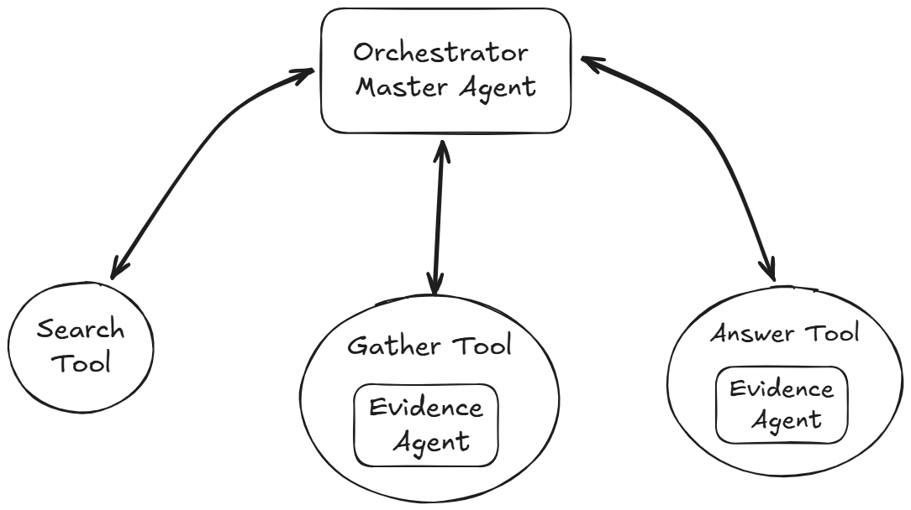
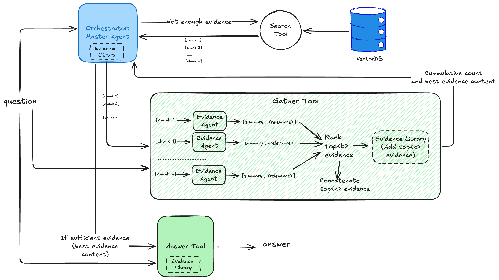

## Table of contents

## Agentic RAG

Traditional RAG (Retrieval-Augmented Generation) systems follow a simple pattern: retrieve relevant documents, then generate an answer. But what if we could make this process more intelligent, more human-like? What if our AI could reason about what to search for, critically evaluate evidence, and iterate on its approach?

This is exactly what the paper [**PaperQA: Retrieval-Augmented Generative Agent for Scientific Research**](https://arxiv.org/abs/2312.07559) explores. Rather than treating RAG as a linear pipeline, the authors propose an **agentic approach** where AI agents can reason, plan, and use tools dynamically to answer complex questions.

In this post, I'll show how I reproduced these concepts by building an agentic system that can search through research papers and provide evidence-based answers about public health topics.

## PaperQA

The authors developed PaperQA, an agent that retrieves information from full-text scientific articles, assesses the relevance of sources and passages, and uses RAG to provide answers. It follows a **search-gather-answer** framework. The agent uses three tools: **search** (*finds relevant papers from online databases*), **gather evidence** (*collects the most relevant chunks from papers and adds them to a context library*), and **answer** (*proposes an answer based on the accumulated contexts*). Gathering evidence before generating an answer is the key component that attracted me to PaperQA.

In traditional RAG, retrieval happens only once. If the retrieved passages are irrelevant or incomplete, the generated answer will likely be incorrect. PaperQA enables an LLM to decide what to search, how many times to search, what content to retrieve, and how to judge relevance—all before answering.

However, the authors used their in-house [agent framework](https://github.com/future-house/aviary) to implement PaperQA. In this post, I'll show how to implement a PaperQA-like agent using the popular OpenAI Agents SDK. This approach allows you to adapt the same concepts to other agent frameworks like LangGraph or Strand Agents.


## My Implementation

My implementation follows the same concepts from the paper with some simplifications while maintaining the core innovation. I use a **retrieve-gather-answer** methodology with multi-agent RAG, where agents function as tools. The key difference: instead of searching for papers online, I initialize and index a vector database with the corpus of papers I want to query. An agent then autonomously retrieves passages, gathers evidence, and answers questions from this database.

My approach consists of one main orchestrator agent with three tools: a search tool for retrieval using semantic search, a gather tool to collect evidence, and an answer tool to review all gathered evidence and summarize the final response. The orchestrator agent follows the [ReAct pattern](https://arxiv.org/abs/2210.03629)—reasoning and acting in a loop: it evaluates which tool to call, calls the tool, evaluates the output, and repeats. This design pattern behaves as a single-agent system because there's no handoff or conversation between agents. However, the complexity lies in how the tools themselves use other agents to achieve their goals and central context memory to share information, as I'll explain below.



### Orchestrator: Master Agent

Given a user query, the master agent uses the search tool to retrieve semantically similar papers from the vector database and updates the Context Library with the retrieved papers. Using the gather tool, the master agent evaluates these papers and determines if it has gathered enough evidence to answer the question. If not, the master continues searching, performing multiple iterations with query reformulation and decomposition until it collects sufficient evidence based on specified parameters.

The agentic approach determines *when* and *what* to search for, as well as when to stop searching—not following a fixed pattern, thus demonstrating truly agentic behavior. When the master agent judge enough evidence has been collected it calls the answer tool to format and answer the question.

```python

@property
def orchestrator_agent(self):
    """Lazy initialization of orchestrator agent."""
    if self._orchestrator_agent is None:
        # Get all tools
        search_tool = self.tool_factory.create_search_tool()
        evidence_tool = self.tool_factory.create_evidence_tool()
        answer_tool = self.tool_factory.create_answer_tool()
        
        collection_name = self.config.collection_filter.upper() if self.configcollection_filter != 'all' else 'CDC'
        
        self._orchestrator_agent = Agent[SessionState](
            name=f"{collection_name}Agent",
            instructions=self._get_collection_instructions(),
            model=self.config.model_name,
            tools=**[search_tool, evidence_tool, answer_tool]**
        )
    
    return self._orchestrator_agent
```

### Search Tool

 I implemented direct semantic search on a Chroma Vector database rather than keyword search of an online database. The vector database is indexed with overlapping 2500 character chunks embedded with the all-minilm-l6-v2 embedding from sentence transformer. For this experiments I used 2914 articles from Preventing Chronic Disease (PCD) 2004-2023 (volumes 1-20) publicly available in HTML format at [data.cdc.gov](http://data.cdc.gov), pre-processed using langchain HTMLSectionSplitter.

```python
def create_search_tool(self):
    """Create the search tool for finding relevant papers."""
    
    @function_tool
    async def search(state: "RunContextWrapper[SessionState]", question: str) ->str:
        """Use this tool to search for papers content to help answer the question"""
        
        # Update session state
        if state.context.original_question == "":
            state.context.original_question = question
        else:
            state.context.updated_question = question
        print(f"🟢 [Search] Starting paper search for question:{question")                  
        # Perform semantic search
        results = self.vectorstore.semantic_search(
            query=question,
            k=self.config.search_k,
        )
        count_results = len(results)
        state.context.search_results.extend(results)
        state.context.status['Paper'] += count_results
        print(f"🟢 [Search] Paper search returned {count_results} passages frompapers")
        self._print_status(state.context.status)
        
        return f"🟢 [Search] Found {count_results} text passages from the papersthat semantically matches and can help answer the question."
    
    return search
```

### Gather Tool

The gather tool uses the EvidenceAgent in parallel to summarize each chunk returned by the retrieval and score the chunk from 1-10 based on its relevance to the question. The returned chunks are then sorted by score, and only chunks scoring above the relevance_cutoff parameter are added to the Context library. The number of accumulated evidence pieces and best evidence text are then returned to the master agent context for decision-making—whether to continue searching or to answer the question.

The diagram below illustrates the inner workings of the agentic RAG, it demonstrates the complexity of the gather tool using the evidence agent and the importance of the evidence library shared across all tools and agents.



The code below implements the gather tool, which collects and evaluates evidence from retrieved documents.

```python
@function_tool
async def gather_evidence(state: "RunContextWrapper[SessionState]", question: str-> str:
    """Use this tool to gather evidence to help answer the question."""
    print(f"🟢 [Gather] Gathering evidence for question: {question}")
    chunks = state.context.search_results
    # Process evidence in parallel
    tasks = [
        asyncio.create_task(evidence_summary(item['title'] + item['content']question)) 
        for item in chunks
    ]
    results = await asyncio.gather(*tasks)
    print(f"🟢 [Gather] Finished gathering evidence for question: {question}")
    # Filter high-quality evidence
    top_evidence_context = [
        (result.score, result.relevant_information_summary) 
        for result in results 
        if result.score >= self.config.relevance_cutoff
    ]
    count_top_evidence = len(top_evidence_context)
    # Update session state
    state.context.evidence_library.extend(top_evidence_context)
    state.context.status['Evidence'] = len(state.context.evidence_library)
    state.context.status['Relevant'] = len(state.context.evidence_library)
    best_evidence = "\n".join([evidence[1] for evidence in statecontextevidence_library])
    print(state.context.status)
    
    return f"🟢 [Gather] Found and added {count_top_evidence}pieces ofevidencerelevant to the question. Best evidences: {best_evidence}."

return gather_evidence
```

The evidence agent is fundamentally a prompt with structured output.

```python
@property
def evidence_agent(self):
    """Lazy initialization of evidence agent."""
    if self._evidence_agent is None:
        instructions = (
            "You are a helpful research librarian assistant. Your role is tosummarize chunk of evidence from literature. "
            "Summarize the text below to help answer a question. Do not directlyanswer the question, "
            "instead summarize to give evidence to help answer the question. Reply'Not applicable' if text is irrelevant. "
            "Use 2-3 sentences. At the end of your response, provide a score from1-10 on a newline indicating relevance to question. "
            "Do not explain your score."
        )
        
        self._evidence_agent = Agent(
            name="EvidenceAgent",
            instructions=instructions,
            model=self.config.model_name,
            output_type=EvidenceSummary
        )
    return self._evidence_agent
```

### Answer Tool

The answer tool receives the top evidence from the master agent if it has decided enough evidence has been collected. It then evaluates the context to determine whether it can answer the question. Finally, it summarizes a comprehensive final answer.

```python
def create_answer_tool(self):
    """Create the answer generation tool."""
    
    def get_answer_instructions(state: RunContextWrapper[SessionState], agent) ->str:
        """Generate dynamic instructions for answer agent."""
        context_evidence = "\n".join([evidence[1] for evidence in state.contextevidence_library])
        instructions = (
            "Write an answer for the question below based on the provided context."
            "If the context provides insufficient information, reply 'I cannotanswer'. "
            "Answer in an unbiased, comprehensive, and scholarly tone. "
            "If the question is subjective, provide an opinionated answer in theconcluding 1-2 sentences."
        )
        instructions += f"\n## Context: {context_evidence}"
        instructions += f"\n## Question: {state.context.original_question}"
        return instructions
    answer_agent = Agent[SessionState](
        name="AnswerAgent",
        instructions=get_answer_instructions,
        model=self.config.model_name,
    )
    generate_answer = answer_agent.as_tool(
        tool_name="generate_answer",
        tool_description="Use this tool to generate a proposed answer to thequestion when you have collected enough evidence"
    )
    
    return generate_answer
```

## Conclusion and Discussion

This implementation is a proof of concept designed to explore Agentic RAG functionality and key features of the OpenAI Agents SDK. It doesn't include the full range of features found in PaperQA, but you can use it as a guide to build your own agentic RAG system that gathers evidence before answering.

This approach has two core innovations: (1) the ability to run retrieval multiple times, ensuring relevancy and completeness (gathering), and (2) the ability to define and assess evidence before answering. This framework lets you create your own evidence assessment and validation strategy for your use case. Depending on your needs, you could develop innovative approaches to gather and validate evidence that are more reliable than traditional RAG for scientific, financial, or legal Q&A problems.

Additionally, this framework combines several advanced RAG techniques:

1. Query reformulation and expansion: For each retrieval iteration, the master agent reformulates or expands the query to find more evidence.
2. Reranking: The gather tool uses an LLM as a judge to calculate the relevance of each chunk and rerank them, keeping the most relevant ones.
3. Self-correction and self-reflection: Both the master agent and answer agent reflect on the evidence gathered, the question, and the proposed answer before responding.

One concern is cost optimization at scale, given the high number of LLM calls for evidence assessment and the non-deterministic number of iterative tool calls.

This first prototype serves as a baseline that I plan to build upon and improve. For instance, developing an evaluation dataset to assess the agent using a library like Ragas would be a good next step. I also plan to explore how to deploy this solution at scale using cloud platforms. I encourage you to follow the work on FutureHouse's PaperQA2 or similar products like AI2Scholar https://allenai.org/blog/ai2-scholarqa—these can help you develop ideas and intuition for your own agentic RAG approach.

## Project Link

* The full code is available at : https://github.com/mayerantoine/openai-agent-paperqa 
