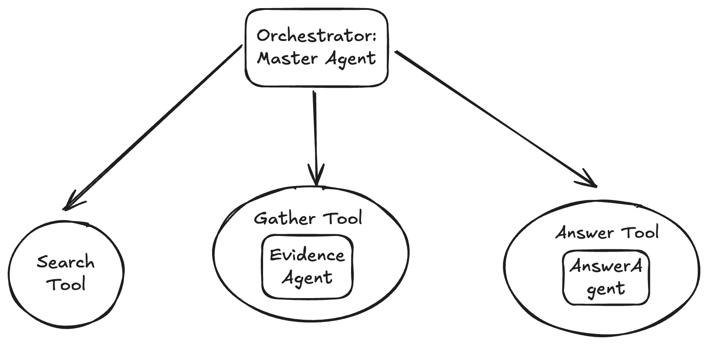
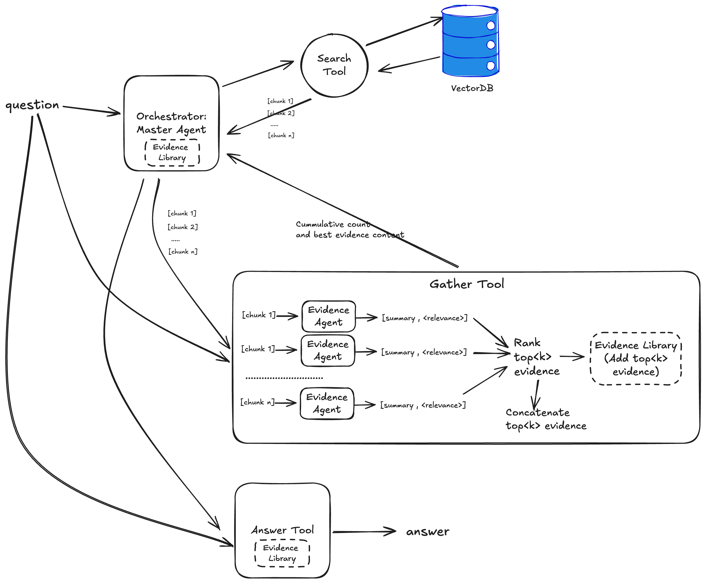
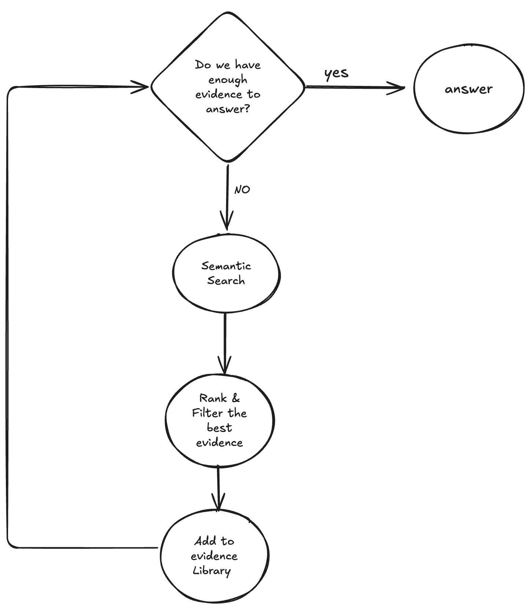

## Table of contents

## Agentic RAG

Traditional RAG (Retrieval-Augmented Generation) systems follow a simple pattern: retrieve relevant documents, then generate an answer. But what if we could make this process more intelligent, more human-like? What if our AI could reason about what to search for, critically evaluate evidence, and iterate on its approach?

This is exactly what the paper "**PaperQA: Retrieval-Augmented Generative Agent for Scientific Research**" explores. Rather than treating RAG as a linear pipeline, the authors propose an **agentic approach** where AI agents can reason, plan, and use tools dynamically to answer complex questions.

In this post, we'll show how we reproduced these concepts using OpenAI's Agent SDK, building a multi-agent system that can search through research papers and provide evidence-based answers about public health topics.

## PaperQA

The authors developed PaperQA, an agent that performs information retrieval across full-text scientific articles, assesses the relevance of sources and passages, and uses RAG to provide answers. This follows a ****search-gather-response**** framework. The agent uses three tools: search (finds relevant papers), gather evidence (collects the most relevant chunks from papers relative to the query into a context library), and answer question (proposes an answer based on the accumulated contexts). The key central component of gathering evidence before generating an answer is what attracted us to PaperQA. Depending on your strategy and algorithm to gather and validate evidence, you could develop innovative approaches that are more reliable than traditional RAG for scientific Q&A problems.

## Our Implementation

We follow the same framework in our implementation with some simplifications while maintaining the core innovation. We plan to improve our agent over time. Our approach uses a retrieve-gather-response methodology with multi-agent RAG where agents function as tools.

We developed one main orchestrator agent with three tools: a search_tool for retrieval using semantic search, a gather_tool (an agent used as a tool) to gather evidence, and an answer tool to review evidence and summarize the final response.**In fact, this design pattern behaves as a single-agent, because there's no handoff or conversation; other agents are used as tools**.



### Orchestrator: Master Agent

Given a user query, the master agent uses the search_tool to retrieve semantically similar papers from the vector database and updates the Context Library with the retrieved papers. Using the gather_tool, the master agent evaluates these papers and determines if it has gathered enough evidence to answer the question. If not, the master continues searching, performing multiple iterations with query reformulation and decomposition until it collects sufficient evidence based on specified parameters.

The agentic approach determines *when* and *what* to search for, as well as when to stop searching—not following a fixed pattern, thus demonstrating truly agentic behavior.

```python

    @property
    def orchestrator_agent(self):
        """Lazy initialization of orchestrator agent."""
        if self._orchestrator_agent is None:
            # Get all tools
            search_tool = self.tool_factory.create_search_tool()
            evidence_tool = self.tool_factory.create_evidence_tool()
            answer_tool = self.tool_factory.create_answer_tool()
            
            collection_name = self.config.collection_filter.upper() if self.config.collection_filter != 'all' else 'CDC'
            
            self._orchestrator_agent = Agent[SessionState](
                name=f"{collection_name}Agent",
                instructions=self._get_collection_instructions(),
                model=self.config.model_name,
                tools=**[search_tool, evidence_tool, answer_tool]**
            )
        
        return self._orchestrator_agent
```

### Search Tool

Unlike the approach in the paper, we implemented direct semantic search on a Chroma Vector database rather than keyword search. Our database is indexed with overlapping 2500 character chunks embedded with the all-minilm-l6-v2 embedding from sentence transformer. We used 2914 articles from Preventing Chronic Disease (PCD) 2004-2023 (volumes 1-20) publicly available in HTML format at [data.cdc.gov](http://data.cdc.gov), pre-processed using langchain HTMLSectionSplitter.

```python
    def create_search_tool(self):
        """Create the search tool for finding relevant papers."""
        
        @function_tool
        async def search(state: "RunContextWrapper[SessionState]", question: str) -> str:
            """Use this tool to search for papers content to help answer the question."""
            
            # Update session state
            if state.context.original_question == "":
                state.context.original_question = question
            else:
                state.context.updated_question = question
            print(f"🟢 [Search] Starting paper search for question:{question}")                  
            # Perform semantic search
            results = self.vectorstore.semantic_search(
                query=question,
                k=self.config.search_k,
            )
            count_results = len(results)
            state.context.search_results.extend(results)
            state.context.status['Paper'] += count_results

            print(f"🟢 [Search] Paper search returned {count_results} passages from papers")
            self._print_status(state.context.status)
            
            return f"🟢 [Search] Found {count_results} text passages from the papers that semantically matches and can help answer the question."
        
        return search
```

### Gather Tool

The gather tool uses the EvidenceAgent in parallel to summarize each chunk returned by the retrieval and score the chunk from 1-10 based on its relevance to the question. The returned chunks are then sorted by score, and only high-quality chunks scoring above the relevance_cutoff parameter are added to the Context library. The number of accumulated evidence pieces and best evidence text are then returned to the master agent context for decision-making—whether to continue searching or to answer the question.

The diagram below attempts to illustrate the inner workings of the agent. While the design pattern above doesn't reveal much about the implementation, this diagram demonstrates the complexity of the gather_tool using the evidence agent and the importance of the evidence library shared across all tools and agents.



The code below implements the gather_tool, which collects and evaluates evidence from retrieved documents.

```python
    @function_tool
    async def gather_evidence(state: "RunContextWrapper[SessionState]", question: str)-> str:
        """Use this tool to gather evidence to help answer the question."""
        print(f"🟢 [Gather] Gathering evidence for question: {question}")
        chunks = state.context.search_results
        # Process evidence in parallel
        tasks = [
            asyncio.create_task(evidence_summary(item['title'] + item['content'],question)) 
            for item in chunks
        ]
        results = await asyncio.gather(*tasks)
        print(f"🟢 [Gather] Finished gathering evidence for question: {question}")
        # Filter high-quality evidence
        top_evidence_context = [
            (result.score, result.relevant_information_summary) 
            for result in results 
            if result.score >= self.config.relevance_cutoff
        ]
        count_top_evidence = len(top_evidence_context)
        # Update session state
        state.context.evidence_library.extend(top_evidence_context)
        state.context.status['Evidence'] = len(state.context.evidence_library)
        state.context.status['Relevant'] = len(state.context.evidence_library)
        best_evidence = "\n".join([evidence[1] for evidence in state.contextevidence_library])
        print(state.context.status)
        
        return f"🟢 [Gather] Found and added {count_top_evidence}pieces of evidencerelevant to the question. Best evidences: {best_evidence}."
    
    return gather_evidence
```

The evidence agent is fundamentally a prompt with structured output.

```python
    @property
    def evidence_agent(self):
        """Lazy initialization of evidence agent."""
        if self._evidence_agent is None:
            instructions = (
                "You are a helpful research librarian assistant. Your role is to summarize chunk of evidence from literature. "
                "Summarize the text below to help answer a question. Do not directly answer the question, "
                "instead summarize to give evidence to help answer the question. Reply 'Not applicable' if text is irrelevant. "
                "Use 2-3 sentences. At the end of your response, provide a score from 1-10 on a newline indicating relevance to question. "
                "Do not explain your score."
            )
            
            self._evidence_agent = Agent(
                name="EvidenceAgent",
                instructions=instructions,
                model=self.config.model_name,
                output_type=EvidenceSummary
            )
        return self._evidence_agent
```

### Answer Tool

The answer tool receives the top evidence from the master agent if it has decided enough evidence has been collected. It then evaluates the context to determine whether it can answer the question. Finally, it summarizes a comprehensive final answer.

```python
    def create_answer_tool(self):
        """Create the answer generation tool."""
        
        def get_answer_instructions(state: RunContextWrapper[SessionState], agent) -> str:
            """Generate dynamic instructions for answer agent."""
            context_evidence = "\n".join([evidence[1] for evidence in state.context.evidence_library])

            instructions = (
                "Write an answer for the question below based on the provided context. "
                "If the context provides insufficient information, reply 'I cannot answer'. "
                "Answer in an unbiased, comprehensive, and scholarly tone. "
                "If the question is subjective, provide an opinionated answer in the concluding 1-2 sentences."
            )
            instructions += f"\n## Context: {context_evidence}"
            instructions += f"\n## Question: {state.context.original_question}"

            return instructions
        answer_agent = Agent[SessionState](
            name="AnswerAgent",
            instructions=get_answer_instructions,
            model=self.config.model_name,
        )
        generate_answer = answer_agent.as_tool(
            tool_name="generate_answer",
            tool_description="Use this tool to generate a proposed answer to the question when you have collected enough evidence"
        )
        
        return generate_answer
```

## Conclusion and Discussion

This implementation is only a proof of concept to understand Agentic RAG functionality and key features of the OpenAI SDK. It does not include the full breadth of features found in PaperQA.

However, it still combines several advanced RAG techniques such as self-correction, adaptability, reranking, query reformulation, query expansion, and rewriting using the LLM's reasoning capability and self-evaluation.

The main loop idea of the **search-gather-response** framework in an agentic way, where the agent autonomously decides when to search, gather more evidence, and answer, is illustrated in the workflow below.



This first throwaway prototype serves as a baseline that we can build upon and improve. For instance, developing our own evaluation dataset to assess the Agent using tools such as RAGA would be a good next step. Continuing to follow the work on FutureHouse in PaperQA2 or similar products such as AI2Scholar [https://allenai.org/blog/ai2-scholarqa](https://allenai.org/blog/ai2-scholarqa) would help develop ideas and intuition to include in our own agentic RAG approach.

## Project Link

* The full code is available at : https://github.com/mayerantoine/openai-agent-paperqa 
